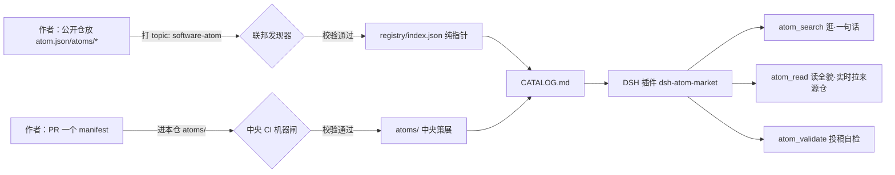

# Software Atom Market · 软件原子市场

> 让 AI 与世界共享**最小能力单元（Atom）**：停止让 AI 一遍遍重写同一段代码，改为从一座带契约、可拼接的原子市场里**选砖、接线、组装**。
> A shared, contract-typed marketplace of software atoms for agents and humans to compose — instead of regenerate.

## 我们要干的事（三件套）

| | 事 | 一句话 |
| --- | --- | --- |
| ① 拆分方法 | **单意图原子性** | 一个原子 = 能一句话说清、不含实现细节的最小能力；再大就拆、再小就合 |
| ② 协议标准 | **原子公约（Manifest）** | 每个原子必须声明：意图 + 输入/输出 + 副作用 + 详情(四节四图) + 版本 |
| ③ 运行检测 | **机器闸** | 结构硬检（含 description 四图），**机器过即收录，无人工评审** |

深挖：方法/扩展草案 → `docs/09`；协议正文 → `SPEC.md`；设计细节 → `docs/03`。

## 架构（一图流）


> 别人的代码/manifest 永不在本仓落盘——`registry/` 只存指针，读取实时回源。

## 快速开始（按角色）

- **我是使用者（Agent/人）** → 装 [`dsh-atom-market`](https://github.com/ZiFan1117/dsh-atom-market)：`dsh plugin add github:ZiFan1117/dsh-atom-market`，然后用 `atom_search` / `atom_read`。零配置。
- **我想发布一个原子** → 读 [`CONTRIBUTING.md`](./CONTRIBUTING.md)：你的公开仓放 `atom.json`（或 `atoms/*.atom.json`）+ 打 topic `software-atom`，机器每日自动发现；想先自检用 `validate-single`（见 [`SPEC.md`](./SPEC.md) §3）。
- **我想读懂协议** → 先读 [`SPEC.md`](./SPEC.md)（怎么写 + 机器怎么验），再看 [`spec/`](./spec/README.md) 三件（schema / 详情规范 / 联邦约定）。
- **我想了解思考与缘起** → [`docs/README.md`](./docs/README.md) 分类索引。

## 仓库地图（标注：✍️ 人工维护 · ⚙️ 机器生成 · 👀 先读）

```
software-atom-market/
├─ README.md            👀 本页（前门）
├─ SPEC.md              👀 协议标准（新朋友先读）
├─ CONTRIBUTING.md      👀 怎么加入（两通道）
├─ LICENSE              MIT
├─ package.json         ✍️ 本仓脚本入口（零 npm 依赖）
├─ spec/                ✍️ 规范三件（机器+人读）
│  ├─ atom.schema.json       manifest 字段/枚举
│  ├─ detail-convention.md   description 怎么写（四节四图）
│  ├─ FEDERATION.md          topic 联邦约定
│  └─ README.md              规范索引
├─ atoms/               ✍️ 中央策展原子（*.atom.json）
├─ registry/index.json  ⚙️ 联邦索引（纯指针；discover 产出，勿手编）
├─ CATALOG.md           ⚙️ 中央+社区目录（generate 产出，勿手编）
├─ scripts/             ✍️ 机器实现（校验/生成/发现）
│  ├─ validate.mjs           目录级校验
│  ├─ validate-single.mjs    投稿者单文件自检
│  ├─ generate-catalog.mjs   生成 CATALOG
│  └─ discover.mjs           联邦发现 → registry/index.json
├─ .github/workflows/   ⚙️ validate-atoms(PR) · federation(每日)
└─ docs/                ✍️ 思考与研究（见 docs/README.md 分类）
```

## Status · 状态

- **已落地**：契约 v0.2（机器闸·四节四图硬检）｜ 联邦纯指针索引 + 每日发现 ｜ 目录自动生成 ｜ 插件 v0.1.2（索引搜索 + 实时回源读取）。`spec`、`scripts`、`atoms` 均为可验证闭环。
- **研究中（非生产承诺）**：原子组装器 `atom_assemble`、DbC 前置/后置/不变量（v0.3+）、对照实验——见 `docs/04`、`docs/09`。
- **与既有生态**：不重复 MCP/Claude Skills/Composio 等"开发者向工具层"；本仓补的是"意图契约 + 机器闸 + 人人/Agent 可拼"的标准层（竞对分析见 `docs/05`）。

## Roadmap · 路线

1. ~~商店闭环 + 联邦 + 机器闸~~（完成）
2. ~~DSH 插件 v0.1.2~~（完成，[独立仓](https://github.com/ZiFan1117/dsh-atom-market)）
3. 组装器 `atom_assemble`（意图 → 检索 → 接线 → 拼装期校验）
4. DbC 断言字段（前置/后置/不变量，随 Runner 落地，v0.3+）
5. 收录官方 dsh 列表（PR #4460 已提，缓步）
6. 对照实验：粒度 × 人群 × AI 组装成功率

## License

MIT © ZiFan1117. 投稿 manifest 默认以 MIT 进入公共库（详见 CONTRIBUTING）。
