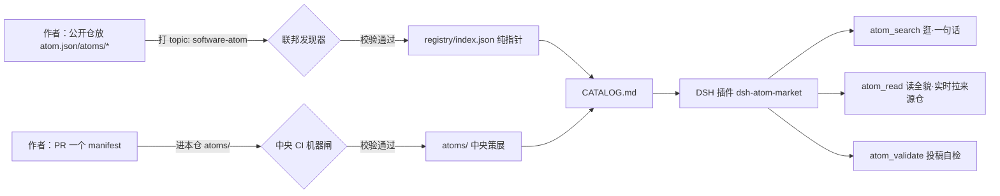

# Software Atom Market · 软件原子市场

> A shared, contract-typed marketplace of **software atoms** — composable, verified, minimal capability units — for agents & humans to pick, wire and assemble, instead of regenerating the same code a thousand times.
>
> 让 AI 与世界共享**最小能力单元（Atom）**：停止让 AI 一遍遍重写同一段代码，改为从一座带契约、可拼接的原子市场里**选砖、接线、组装**。

---

## What we do · 我们要干的事（三件套）

| EN | 中文 | 一句话 |
| --- | --- | --- |
| ① Splitting method | 拆分方法 | **Single-intent atomicity / 单意图原子性** — one atom = a capability you can describe in one intent-sentence with no implementation detail; bigger → split, smaller → merge |
| ② Protocol standard | 协议标准 | **Atom Manifest / 原子公约** — each atom must declare intent + input/output + side effects + detail(four sections, four Mermaid diagrams) + version |
| ③ Runtime gate | 运行检测 | **Machine gate / 机器闸** — structural hard-check (incl. the four diagrams); **pass = listed, no human review** |

Deep dives: framework & extensions → `docs/design/09`; protocol → `SPEC.md`; design → `docs/design/03`.

### Language- & shape-agnostic · 语言无关、形态无关

> Atoms are **not bound to any language or shape**. An atom may be a tiny function, a library, or even a whole framework — as long as it is one intent with a working contract that passes the machine gate. **Frameworks are atoms too.**
>
> 原子**不绑定语言、不限定形态**：可以是函数级实现、一个库，甚至一个框架/工具集——只要它满足"一次意图 + 契约完整 + 机器校验通过"即可收录。**框架也是原子。**（`lang` 字段仅作标注，不作约束。）

## Architecture · 架构


> No third-party code/manifest ever lands in this repo — `registry/` stores pointers only; reads go back to source live.
> 别人的代码/manifest 永不在本仓落盘——`registry/` 只存指针，读取实时回源。

## Quick start · 快速开始（按角色）

- **User (agent/human) · 使用者** → install [`dsh-atom-market`](https://github.com/ZiFan1117/dsh-atom-market): `dsh plugin add github:ZiFan1117/dsh-atom-market`, then `atom_search` / `atom_read`. Zero config. 零配置。
- **Publisher · 想发布一个原子** → read [`CONTRIBUTING.md`](./CONTRIBUTING.md): put `atom.json` (or `atoms/*.atom.json`) in your public repo + tag topic `software-atom`; the machine discovers daily. Pre-check with `validate-single` (see [`SPEC.md`](./SPEC.md) §3). 放你公开仓 + 打 topic，机器每日发现；想先自检用单文件脚本。
- **Protocol reader · 想读懂协议** → [`SPEC.md`](./SPEC.md) first, then [`spec/`](./spec/README.md) (schema / detail-convention / FEDERATION). 先读 SPEC，再看 spec/ 三件。
- **Thinker · 想看思考与缘起** → [`docs/README.md`](./docs/README.md) (categorized). 分类索引在 docs/README。

## Repo map · 仓库地图（✍️ 人工 · ⚙️ 机器生成 · 👀 先读）

```
software-atom-market/
├─ README.md            👀 本页（前门 / front door）
├─ SPEC.md              👀 协议标准（protocol · 新朋友先读）
├─ CONTRIBUTING.md      👀 怎么加入（how to join: federation / PR）
├─ LICENSE              MIT
├─ package.json         ✍️ 脚本入口（zero npm deps）
├─ spec/                ✍️ 规范三件（schema / detail-convention / FEDERATION / README）
├─ atoms/               ✍️ 中央策展原子（*.atom.json）
├─ registry/index.json  ⚙️ 联邦索引（纯指针，discover 产出，勿手编）
├─ CATALOG.md           ⚙️ 目录（central+community，generate 产出，勿手编）
├─ scripts/             ✍️ 机器实现（validate / validate-single / generate / discover）
├─ .github/workflows/   ⚙️ validate-atoms(PR) · federation(每日)
└─ docs/                ✍️ 思考与研究（intro/design/research，见 docs/README.md）
```

## Status · 状态

- **Live · 已落地**：Contract v0.2 (machine gate, four-section/four-diagram) · federated pointer index + daily discovery · auto catalog · plugin v0.1.2 (index search + live source read). 契约 v0.2 机器闸、联邦纯指针+每日发现、目录自动生成、插件 v0.1.2（索引搜索+实时回源）。
- **Research (not production promise) · 研究中**：`atom_assemble`, DbC pre/post/invariants (v0.3+), controlled experiments — see `docs/research/04`, `docs/design/09`.
- **vs. ecosystem · 与既有生态**：not a duplicate of MCP / Claude Skills / Composio tool layers; we add the **intent-contract + machine-gate + human/agent-composable** layer (analysis → `docs/research/05`).

## Roadmap · 路线

1. ~~Store loop + federation + machine gate~~ (done)
2. ~~DSH plugin v0.1.2~~ (done, [standalone repo](https://github.com/ZiFan1117/dsh-atom-market))
3. Assembler `atom_assemble` (intent → search → wire → assemble-time checks)
4. DbC fields (pre/post/invariants) with a Runner, v0.3+
5. Official dsh list listing (PR #4460 opened)
6. Controlled experiments: granularity × audience × AI assembly success

## License

MIT © ZiFan1117. Submitted manifests default to MIT into the public store (see CONTRIBUTING). 投稿 manifest 默认以 MIT 进入公共库。
