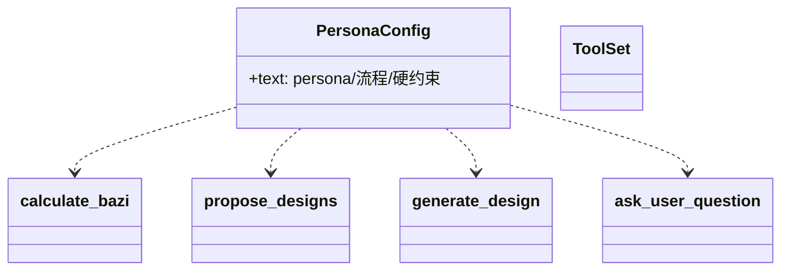
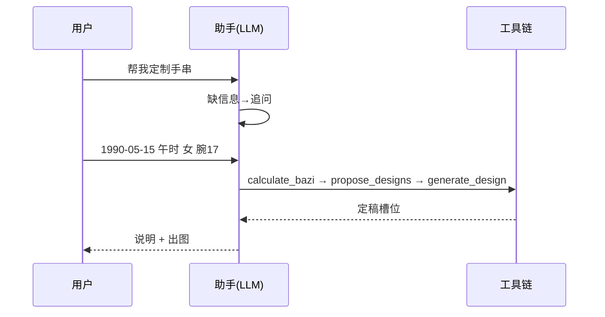
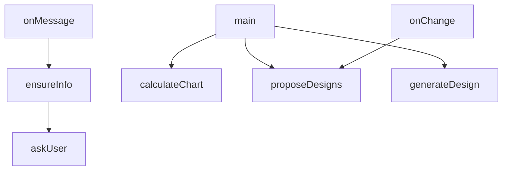

## 它做什么

定义“手串定制助手”角色：严格流程、硬约束与话术。确定性实现：不调用 LLM、不依赖网络、可重复可测试（CPU 上“算账”）。

定义“手串定制助手”角色（agent.cordis.yml persona）：缺信息先 ask_user_question → 排盘(calculate_bazi) → 提案(propose_designs) → 直接定稿出图(generate_design)；换款只重 propose 不重排盘。硬约束：禁止自算旺衰/喜忌、禁止编造珠名/缩写、禁止展示八字内部、回复≤150 字。

## 怎么实现

**1) 数据流转（flowchart：一份数据从输入到输出怎么走）**
```mermaid
flowchart LR
A[用户对话] --> B{信息齐全?}
B -- 否 --> Q[ask_user_question 追问]
B -- 是 --> C[calculate_bazi]
C --> D[propose_designs]
D --> E[generate_design 直接出图]
E --> F[回复 ≤150 字]
换款: D2[propose_designs(限定) → generate_design]，不重排盘
```

**2) 模块分解（classDiagram：代码/类怎么划分与归属）**


**3) 交互时序（sequenceDiagram：调用方与本原子/下游怎么协作）**


**4) 调用图（graph：本原子及其 import 的下游组合关系）**


## 何时用

- 适用：把确定性工具封装成可对话的定制助手；跨会话挂载。
- 不适用：不是计算器本身；任何计算必须经工具。

## 示例

对话流：用户给生辰→工具排盘→喜忌→挑 B-01→出图；用户说“换红色珠子”→ propose_designs(限定) 重出方案（不重排盘）。
