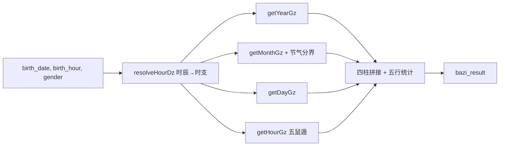
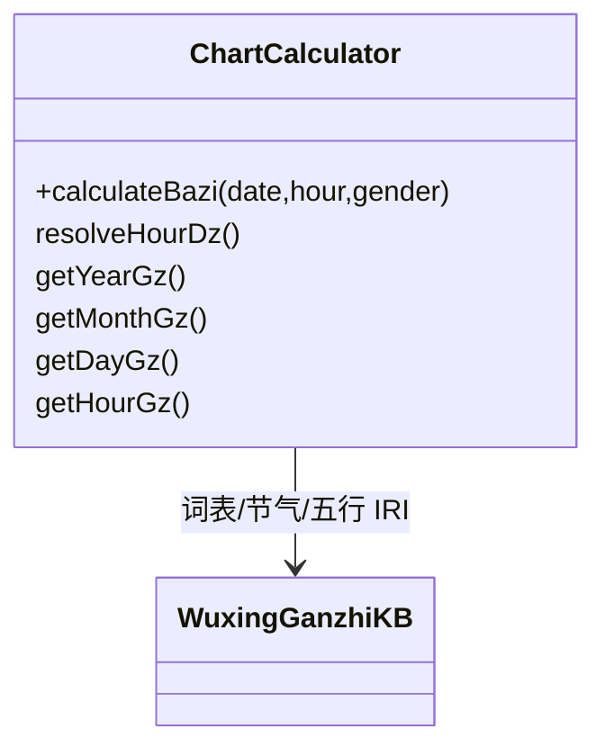
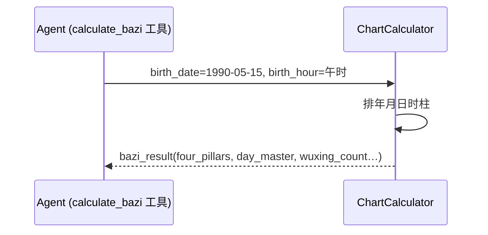
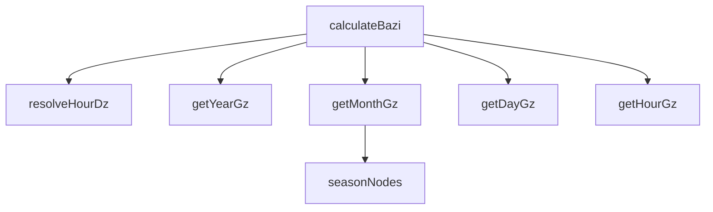

## 它做什么

把公历生辰与时辰排成四柱八字并统计五行。确定性实现：不调用 LLM、不依赖网络、可重复可测试（CPU 上“算账”）。

把公历生日+时辰排成四柱并统计五行。内部先 resolveHourDz 把时辰名/数字映射到时支；再分 年柱(getYearGz)、月柱(getMonthGz，按节气表分月)、日柱(getDayGz，UTC 天数基准)、时柱(getHourGz) 得到天干地支，最后累计五行计数与明细。gender 暂不影响排盘。

## 怎么实现

**1) 数据流转（flowchart：一份数据从输入到输出怎么走）**

**2) 模块分解（classDiagram：代码/类怎么划分与归属）**

**3) 交互时序（sequenceDiagram：调用方与本原子/下游怎么协作）**

**4) 调用图（graph：本原子及其 import 的下游组合关系）**

## 何时用

- 适用：模型拿到生辰后由确定性工具排盘，禁止 LLM 自行推算干支。
- 不适用：不推喜忌、不配珠、不做最终方案。

## 示例

输入 { birth_date:"1990-05-15", birth_hour:"午时", gender:"女" } → { type:"bazi_result", four_pillars:"…", day_master:"庚金", day_master_element:"金", month_branch_wuxing:"金", wuxing_count:{…} }。
