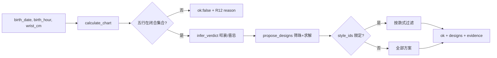
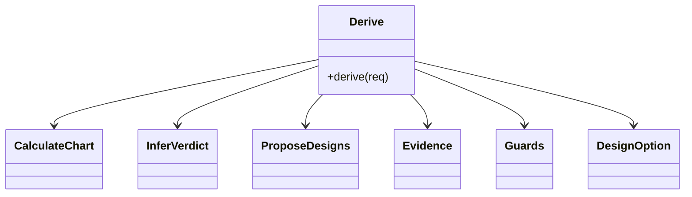
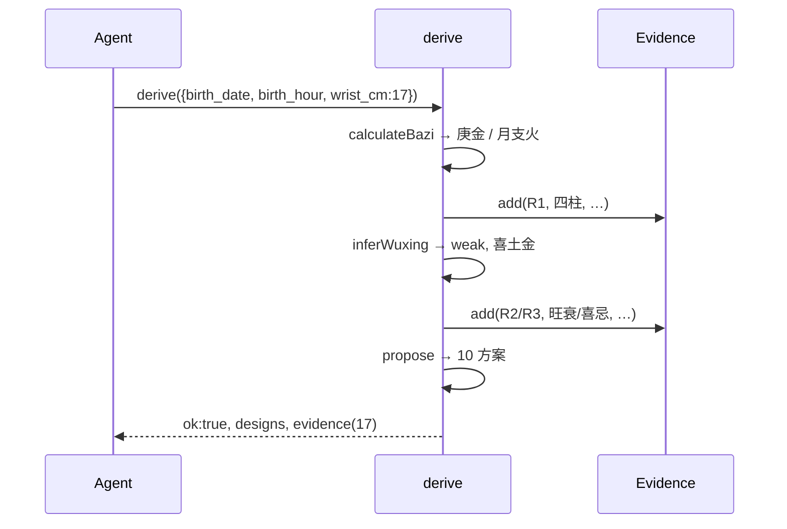
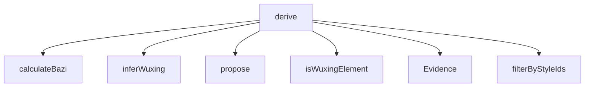

## 它做什么

统一确定性推导：生日+时辰 → 八字/旺衰/喜忌 → 候选材质 → 各款式逐槽方案，附 R1–R14 证据链。确定性实现：不调用 LLM、不依赖网络、可重复可测试。

一次调用把原先“排盘 → 提方案”两步合成一条可解释链：每步写入证据（规则编号 + 输入 + 结论），域外输入按封闭世界语义返回 `ok:false` 与 `reason`，而不是给“可能的答案”。可选 `style_ids` 只对指定款式求解。

## 怎么实现

**1) 数据流转（flowchart：一份数据从输入到输出怎么走）**

**2) 模块分解（classDiagram：代码/类怎么划分与归属）**

**3) 交互时序（sequenceDiagram：调用方与本原子/下游怎么协作）**

**4) 调用图（graph：本原子及其 import 的下游组合关系）**

## 何时用

- 适用：Agent 一次调用拿到完整可解释方案；需要封闭世界拒绝域外输入时。
- 不适用：不落盘（持久化在 bazidiy.design_memory）；不做最终文案定稿（定稿在 bazidiy.generate_design）。

## 示例

输入 `{ birth_date:"1990-05-15", birth_hour:"午时", wrist_cm:17 }` → `{ ok:true, day_master:"庚金", strength:"weak", favorable:["土","金"], unfavorable:["火","水"], designs:[10], evidence:[17] }`；指定 `style_ids:["B-02"]` 时只返回 B-02 的方案，无解则 `ok:false` + `reason`。
