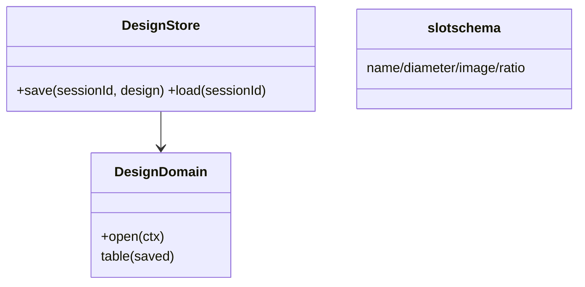
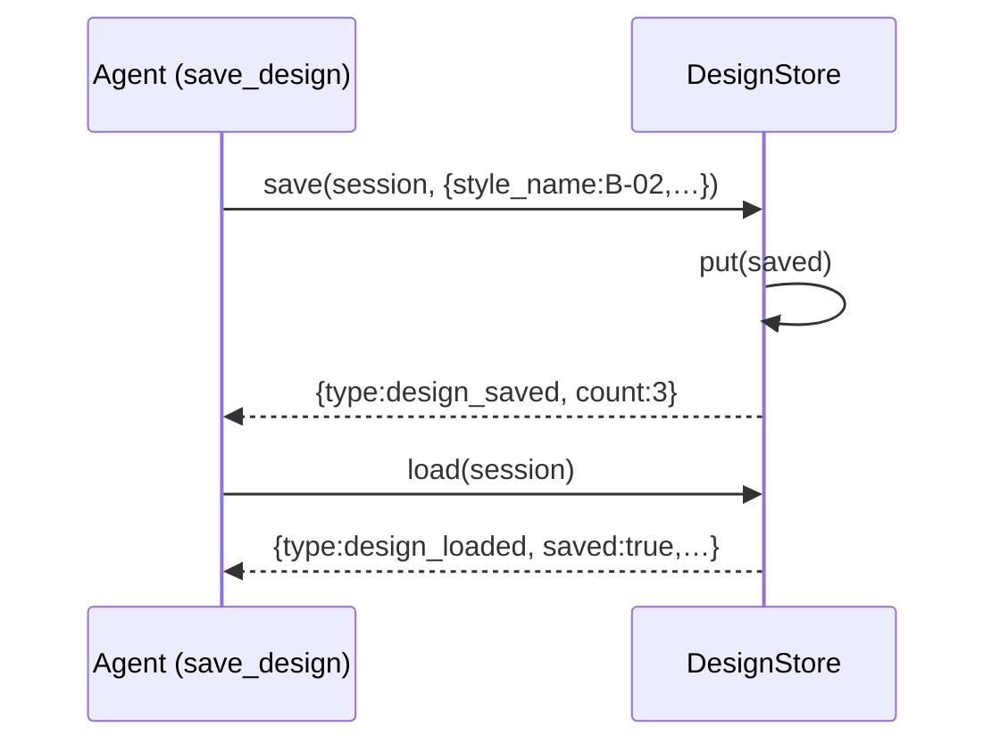
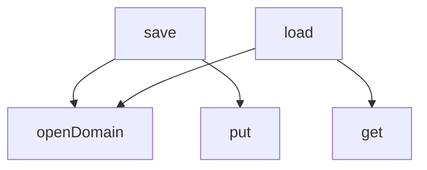

## 它做什么

按会话保存/恢复一次最终设计方案（save/load 两方法）。确定性实现：不调用 LLM、不依赖网络、可重复可测试（CPU 上“算账”）。

会话级方案存取：以 sessionId 为记录键，一张 saved 表 put/get。save_design 存定稿（style/slots/wrist/summary/rationale），load_design 读回；未存过返回 saved=false。需在 agent 会话内执行（依赖 exec.agent.session）。

## 怎么实现

**1) 数据流转（flowchart：一份数据从输入到输出怎么走）**
```mermaid
flowchart LR
save: IN[design] --> OPEN[open domain] --> PUT[table saved.put(sessionId, design)] --> CLOSE --> OUT[saved]
load: R[read] --> GET[table saved.get(sessionId)] --> CLOSE2 --> OUT2[loaded|not-found]
```

**2) 模块分解（classDiagram：代码/类怎么划分与归属）**


**3) 交互时序（sequenceDiagram：调用方与本原子/下游怎么协作）**


**4) 调用图（graph：本原子及其 import 的下游组合关系）**


## 何时用

- 适用：保存定稿后免重推理即可恢复同会话方案。
- 不适用：无会话上下文时拒绝（需 exec.agent.session）。

## 示例

save → { type:"design_saved", style_name:"B-02", count:3 }；load → { type:"design_loaded", saved:true, slots:[…] } 或 { saved:false }。
