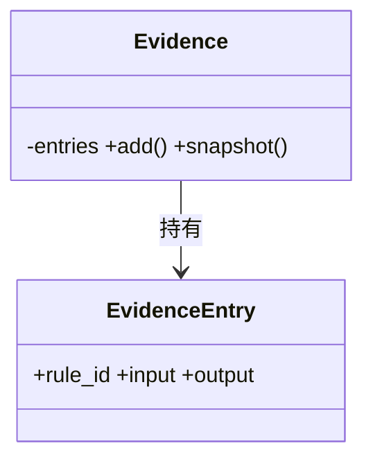
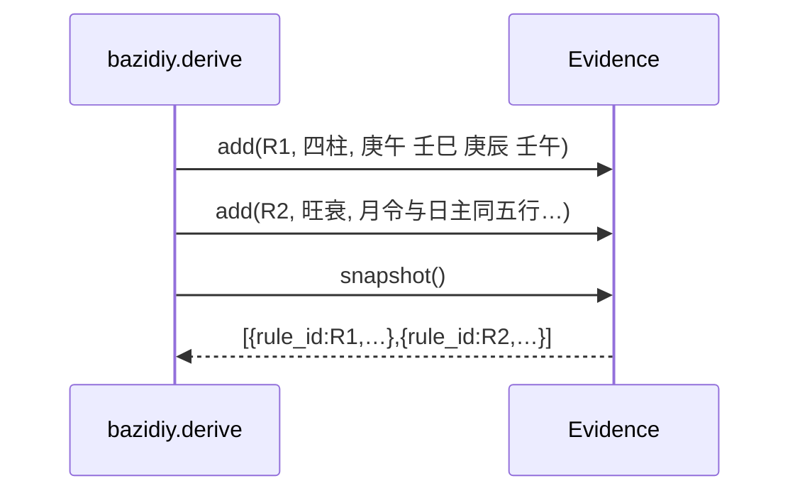
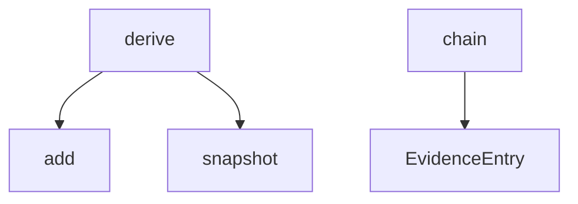

## 它做什么

按步骤记录推导证据链（rule_id + 输入 + 结论），供逐条回放。确定性实现：不调用 LLM、不依赖网络、可重复可测试。

证据链是“结论 → 规则”的可追溯出口：每次推导把命中的规则编号与该步的输入/结论写入 `Evidence`，最后用 `snapshot()` 导出副本。调用方据此解释“为什么得到这个结果”，而不需要读实现代码。

## 怎么实现

**1) 数据流转（flowchart：一份数据从输入到输出怎么走）**
```mermaid
flowchart LR
IN[rule_id, input, output] --> A[Evidence.add]
A --> B[entries 顺序累积]
B --> C[snapshot 副本]
C --> OUT[EvidenceEntry[]]
```

**2) 模块分解（classDiagram：代码/类怎么划分与归属）**


**3) 交互时序（sequenceDiagram：调用方与本原子/下游怎么协作）**


**4) 调用图（graph：本原子及其 import 的下游组合关系）**


## 何时用

- 适用：任何需要“结论可追溯到规则编号”的确定性推导。
- 不适用：不生成结论本身；不做持久化（证据随结果返回）。

## 示例

推导过程中记录 `{ rule_id: "R5", input: "候选(喜用∖忌)", output: "南红:火、小叶紫檀:木…" }`，最终随 `derive` 结果一起返回，共 17 条。
