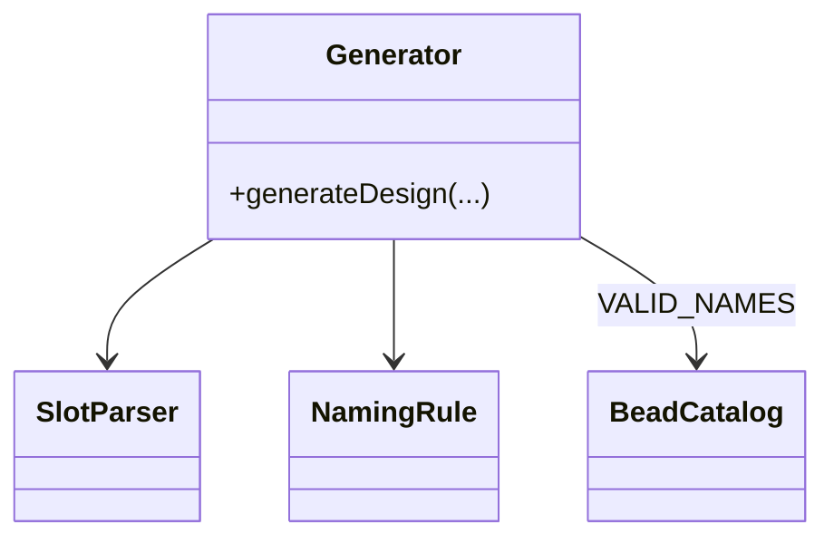
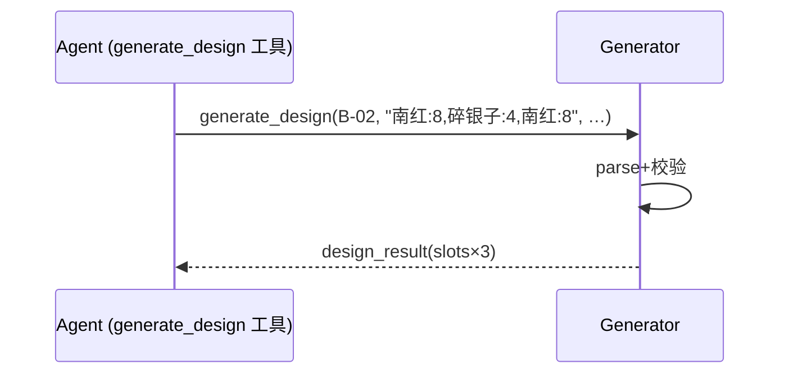
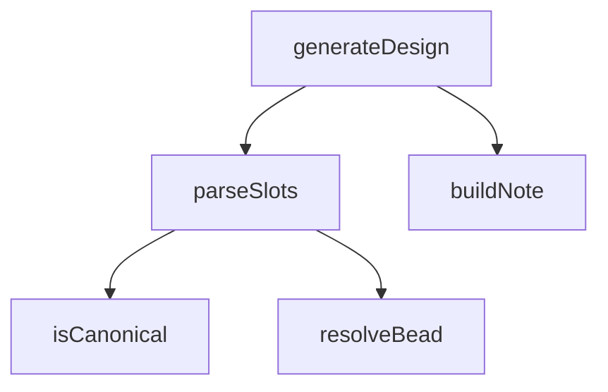

## 它做什么

解析并校验完整珠序后定稿最终手串方案。确定性实现：不调用 LLM、不依赖网络、可重复可测试（CPU 上“算账”）。

定稿（框架性）：接受款式+珠序串，经 parse_slots 解析与 naming 全称硬校验；任一珠名非法 → 输出带 note 的 design_result（提示用全称），否则输出可渲染的 slots（image/ratio）供前端 SVG 与 save。summary 限 ≤50 字。

## 怎么实现

**1) 数据流转（flowchart：一份数据从输入到输出怎么走）**
```mermaid
flowchart LR
IN[style_name, beads, summary, rationale] --> P[parse_slots 解析珠序]
P --> C{解析通过?}
C -- 否 --> OUT[design_result + note 珠名未识别]
C -- 是 --> OUT2[design_result + slots(w/ image/ratio) + presentationMeta]
```

**2) 模块分解（classDiagram：代码/类怎么划分与归属）**


**3) 交互时序（sequenceDiagram：调用方与本原子/下游怎么协作）**


**4) 调用图（graph：本原子及其 import 的下游组合关系）**


## 何时用

- 适用：模型从 propose 的 designs 挑一款后“逐字照抄”珠序定稿出图。
- 不适用：不重新排盘/判喜忌；不接受缩写、库外珠名、自创珠序。

## 示例

输入 { style_name:"B-02", beads:"南红:8,碎银子:4,南红:8", wrist_size:"17", summary:"…" } → { type:"design_result", slots:[{name:南红,diameter:8,…}×3] }；若写成"玛瑙:8" → 输出含 note 的拒绝结果。
