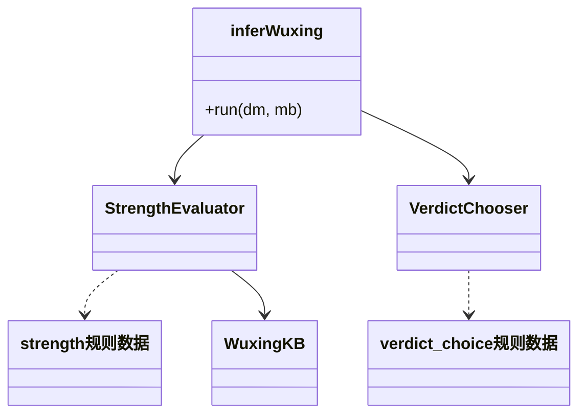
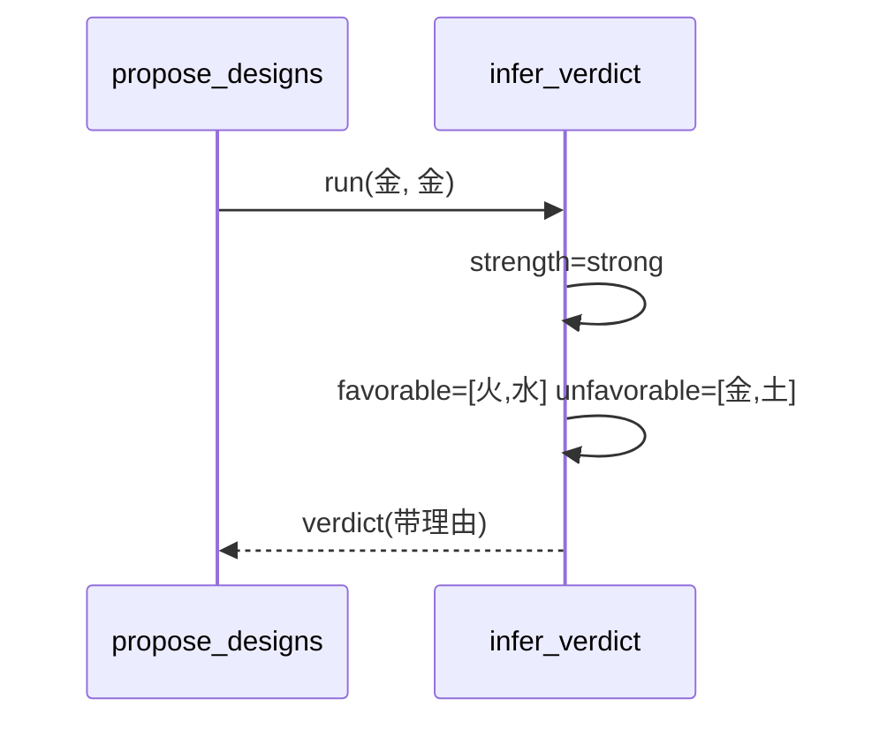
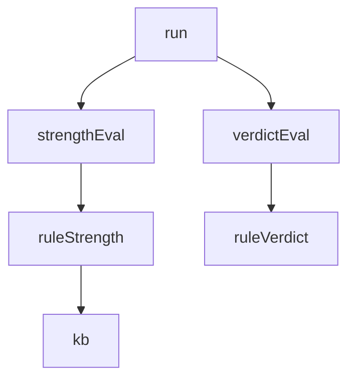

## 它做什么

判定日主旺衰并推导喜用神与忌神。确定性实现：不调用 LLM、不依赖网络、可重复可测试（CPU 上“算账”）。

把“日主五行+月支五行”转成 旺衰→喜忌 全判：先调 rules.strength 判 strong/weak，再调 rules.verdict_choice 按 strength 取喜忌；输出 strength_reasons 与 reasons，供 propose_designs 与前端引用，禁止 AI 自算。

## 怎么实现

**1) 数据流转（flowchart：一份数据从输入到输出怎么走）**
```mermaid
flowchart LR
IN[day_master_element, month_branch_wuxing] --> S[Evaluator(rules.strength)]
S --> STR[strong|weak]
STR --> V[VerdictChoice(rules.verdict_choice)]
V --> OUT[favorable[]+unfavorable[]+reasons[]]
```

**2) 模块分解（classDiagram：代码/类怎么划分与归属）**


**3) 交互时序（sequenceDiagram：调用方与本原子/下游怎么协作）**


**4) 调用图（graph：本原子及其 import 的下游组合关系）**


## 何时用

- 适用：一切需要喜忌判定的调用（propose_designs 主路径）。
- 不适用：不排盘；日主/月支须由 calculate_chart 给出。

## 示例

输入 { day_master_element:"金", month_branch_wuxing:"金" } → { strength:"strong", favorable:["火","水"], unfavorable:["金","土"], strength_reasons:[…], reasons:[…] }。
