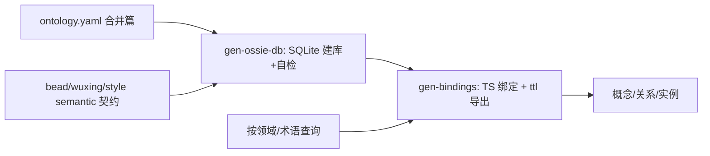
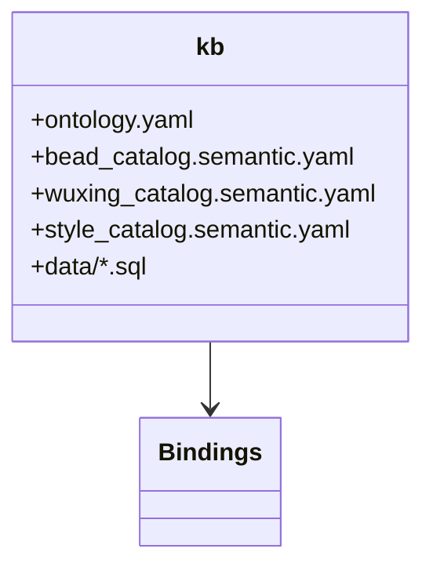
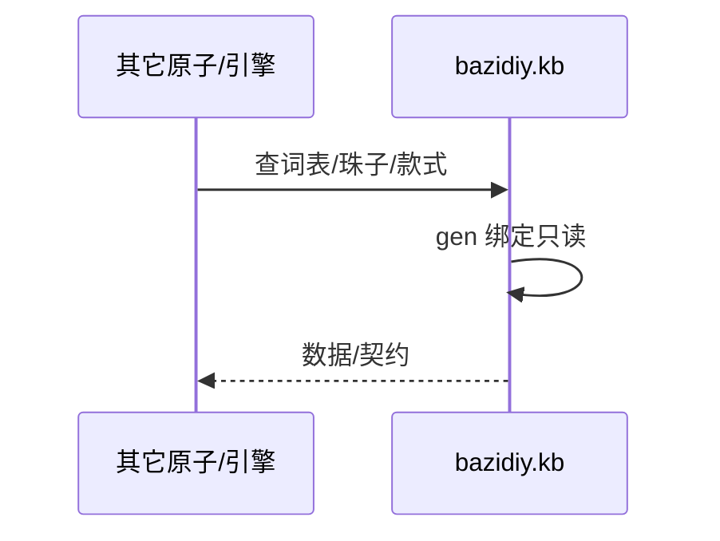
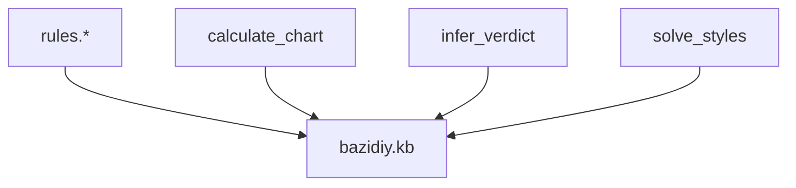

## 它做什么

BaziDIY 领域本体与数据唯一源（3 合 1）：五行/干支/节气、珠料×变体=珠实例、款式槽位，以及生克关系与值类型约束。确定性纯数据/绑定，不调 LLM、不联网。

按 Apache Ossie（v0.2）组织：概念/关系/requires 在合并篇 `ontology.yaml`；实例分域落 SQLite（`data/*.sql`）；生成只读绑定供其它原子引用。

## 怎么实现

**1) 数据流转（flowchart）**

**2) 模块分解（classDiagram）**

**3) 交互时序（sequenceDiagram）**

**4) 调用图（graph）**

## 何时用

- 适用：全领域概念/实例/契约的权威来源；构建其它原子与对外数据接口。
- 不适用：不做判据/求解（那是 rules.* 与能力原子）。

## 示例

输入 { domain:"bead", term:"nanhong_round" } → 输出该珠实例（材料/变体/五行/直径/图）；输入 { domain:"wuxing", term:"金" } → 生=水、克=木。
