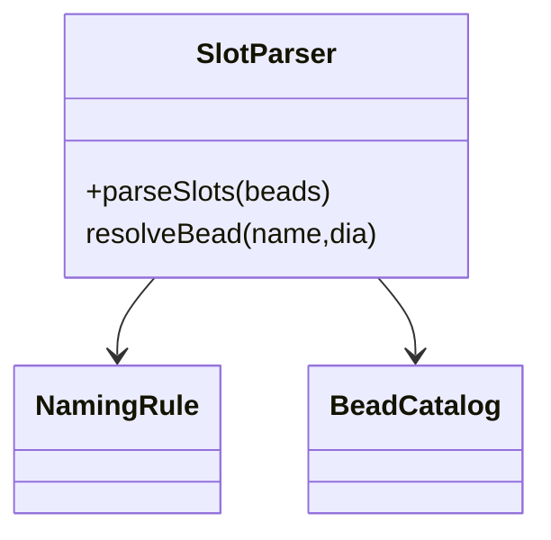
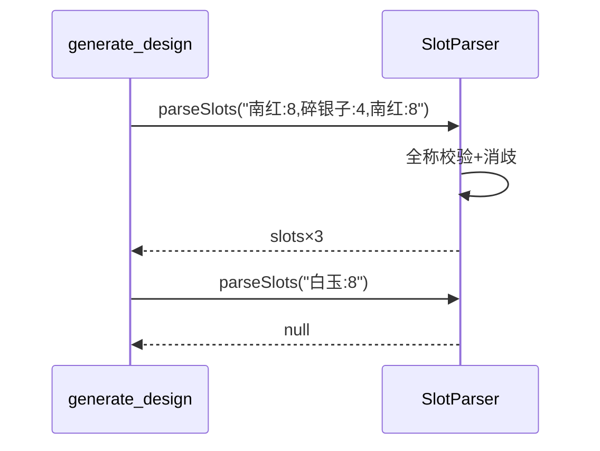
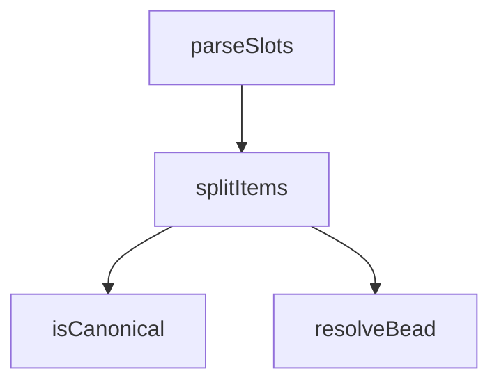

## 它做什么

把“珠名:直径,珠名:直径”珠序串解析消歧为槽位序列。确定性实现：不调用 LLM、不依赖网络、可重复可测试（CPU 上“算账”）。

把“珠名:直径,珠名:直径”文本解析成槽位：按逗号拆分项、按冒号拆 名/直径；逐个经 naming 判据全称校验（VALID_NAMES）与同名变体消歧（直径匹配、round 优先）；任何名字非法 → 整体返回 null，供 generate_design 拒绝缩写。

## 怎么实现

**1) 数据流转（flowchart：一份数据从输入到输出怎么走）**
```mermaid
flowchart LR
IN[beads 串] --> SP[split(,) 逐项]
SP --> C{含 : 且名字在全称集}
C -- 否 --> OUT[null]
C -- 是 --> R[resolveBead(name, dia)]
R --> D[record slot(image, ratio)]
D --> OUT2[slots[]]
```

**2) 模块分解（classDiagram：代码/类怎么划分与归属）**


**3) 交互时序（sequenceDiagram：调用方与本原子/下游怎么协作）**


**4) 调用图（graph：本原子及其 import 的下游组合关系）**


## 何时用

- 适用：把 LLM 照抄的珠序转成可渲染/可保存槽位。
- 不适用：不排盘；不判喜忌。

## 示例

输入 { beads:"南红:8,碎银子:4,南红:8" } → { valid:true, slots:[{name:南红,diameter:8,slot:0,image:nanhong_round,…},…] }；含“白玉”则 valid:false。
