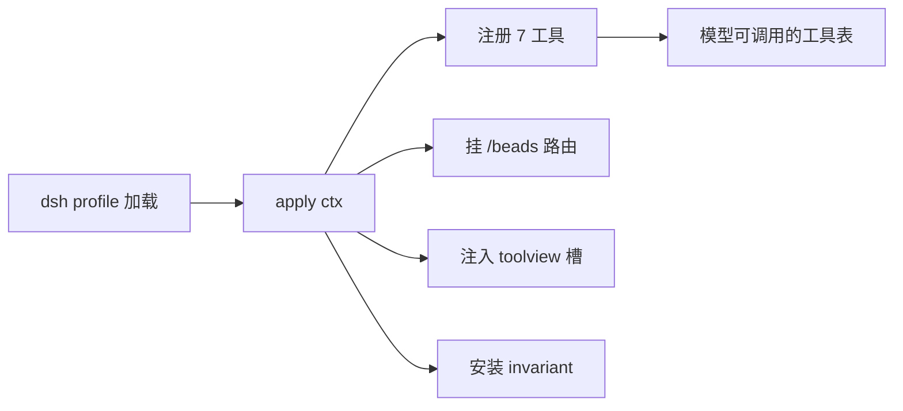
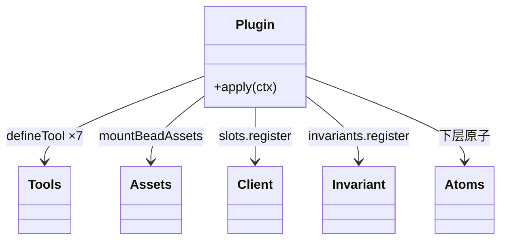
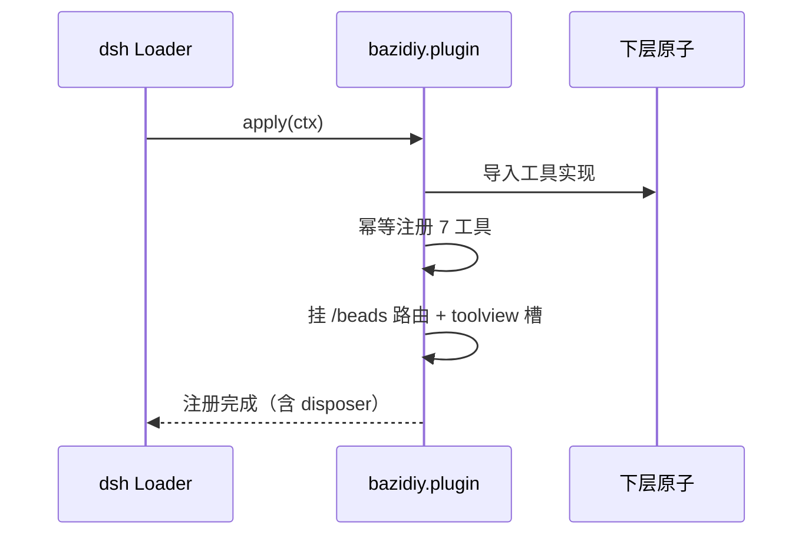
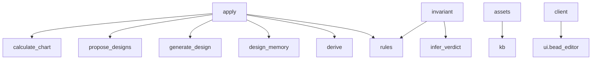

## 它做什么

把 7 个确定性工具与三项装配能力（珠子静态路由 / 客户端 toolview / 运行时 invariant）注册进 dsh 宿主。框架原子：本身不做领域计算，只把下层原子装配成可用的插件。

注册面：`calculate_bazi`、`propose_designs`、`generate_design`、`save_design`、`load_design`、`beads_derive`、`beads_rules`（幂等注册，重复挂载不报错）；`/beads` 前缀路由（静态 PNG + `/beads/catalog.json`）；`tool.call.toolview` 槽的 `generate_design` 卡片；`@bazidiy/ontology` 的加载期 invariant（喜忌无交集 + 目录计数 + 五行单值 + 生克闭合）。

## 怎么实现

**1) 数据流转（flowchart：一份数据从输入到输出怎么走）**

**2) 模块分解（classDiagram：代码/类怎么划分与归属）**

**3) 交互时序（sequenceDiagram：调用方与本原子/下游怎么协作）**

**4) 调用图（graph：本原子及其 import 的下游组合关系）**

## 何时用

- 适用：在 dsh profile 中加载本插件即获得全部模型工具、珠子图与结果卡片、以及加载期数据校验。
- 不适用：不做领域计算（在能力原子）；不发布到原子市场以外的运行环境。

## 示例

`dsh web --patch apps/cli/config/bazidiy.patch.yml` → 插件行激活后 `ctx.tools` 出现 7 个工具、`/beads/catalog.json` 可访问、`generate_design` 结果渲染手串卡片；invariant 在加载期报告 0 冲突。
