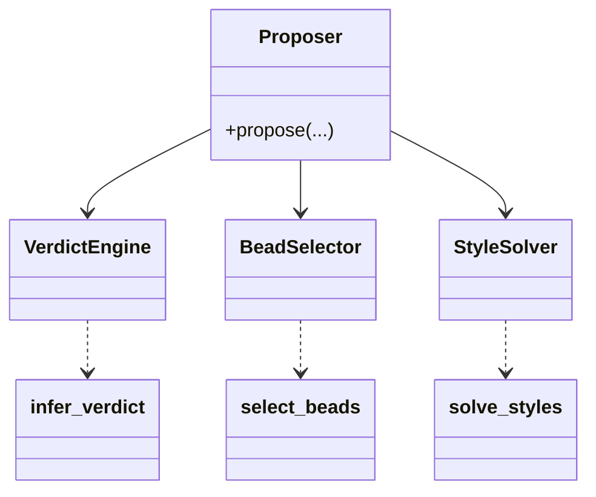
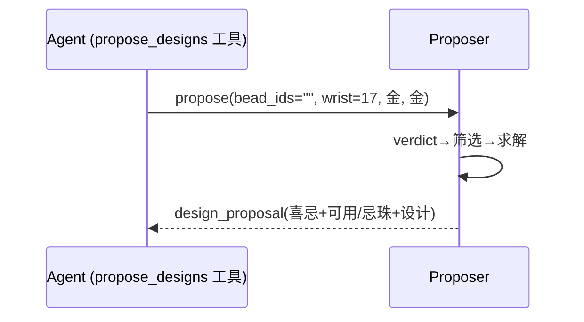
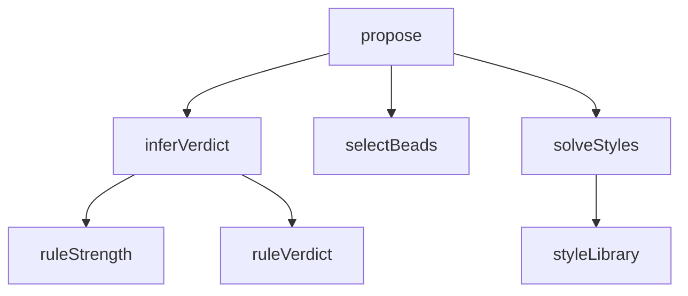

## 它做什么

一链出方案：旺衰→喜忌→筛珠→款式求解→给喜忌珠与可选方案。确定性实现：不调用 LLM、不依赖网络、可重复可测试（CPU 上“算账”）。

一链提案（框架性）：把 infer_verdict(旺衰→喜忌) → select_beads(按喜忌筛珠) → solve_styles(款式求解) 串成对模型的一次调用，直接返回 favorable/unfavorable/suitable/unsuitable/designs。任何判定都不允许 AI 自行推算。

## 怎么实现

**1) 数据流转（flowchart：一份数据从输入到输出怎么走）**
```mermaid
flowchart LR
IN[day_master_element, month_branch_wuxing, wrist_size, bead_ids] --> V[infer_verdict]
V --> FAV[favorable/unfavorable]
FAV --> SEL[select_beads 筛珠]
SEL --> SOL[solve_styles 求解]
SOL --> OUT[design_proposal(含 designs/unavailable_styles)]
```

**2) 模块分解（classDiagram：代码/类怎么划分与归属）**


**3) 交互时序（sequenceDiagram：调用方与本原子/下游怎么协作）**


**4) 调用图（graph：本原子及其 import 的下游组合关系）**


## 何时用

- 适用：模型主流程的“提方案”一步；换款/加限定也走这里（不重排盘）。
- 不适用：不做最终文案定稿（那是 generate_design）。

## 示例

输入 { bead_ids:"", wrist_size:17, day_master_element:"金", month_branch_wuxing:"金" } → { type:"design_proposal", favorable:[火,水], unsuitable:[{五行金/土珠, reason…}], designs:[{style:"B-01",…}], unavailable_styles:[…] }。
