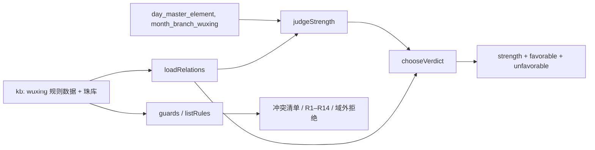
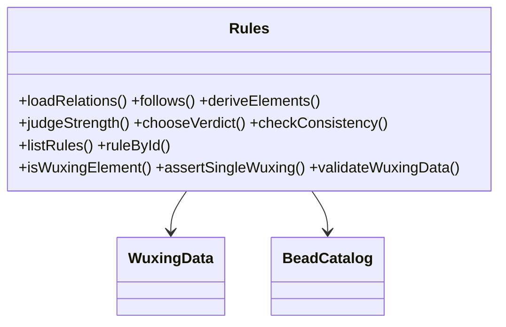
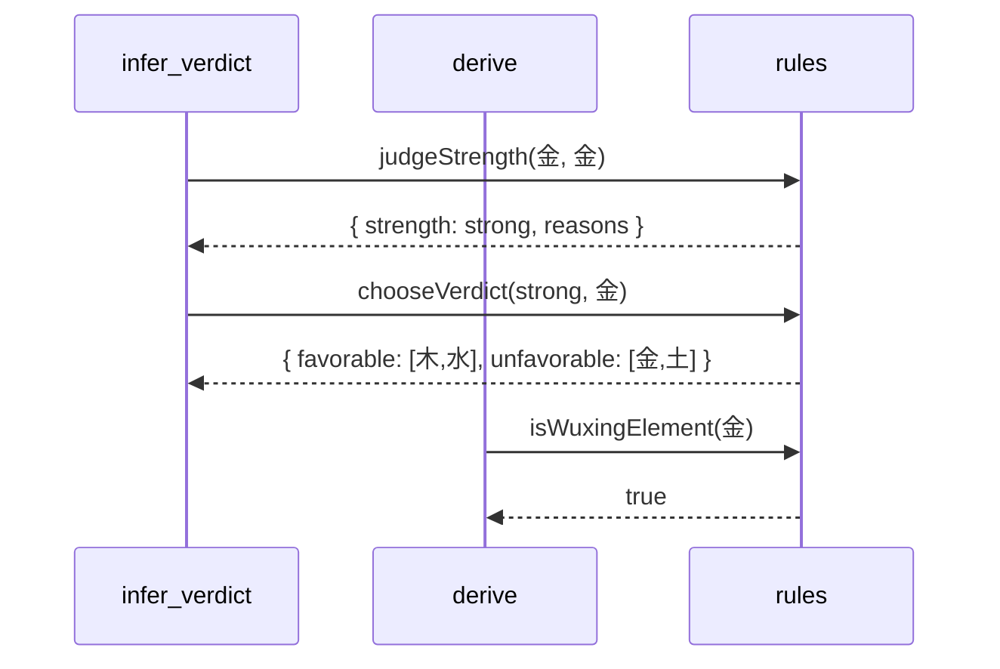
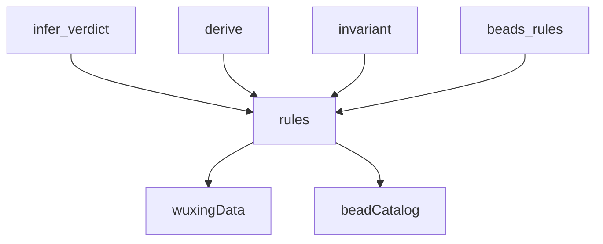

## 它做什么

五行判据与约束：生克关系遍历、旺衰、喜忌、全组合自检、R1–R14 规则清单与封闭世界守卫。确定性实现：不调用 LLM、不依赖网络、可重复可测试。

一个原子覆盖“判据 + 可发现性 + 校验”三件事：`judgeStrength`/`chooseVerdict` 从 kb 的规则数据判旺衰与喜忌；`loadRelations`/`follows`/`deriveElements` 提供生克遍历；`checkConsistency` 做 5×5 全组合自检；`listRules` 输出 R1–R14 清单供调用方先知道边界；`isWuxingElement`/`assertSingleWuxing`/`validateWuxingData` 等守卫实现封闭世界拒绝。

## 怎么实现

**1) 数据流转（flowchart：一份数据从输入到输出怎么走）**

**2) 模块分解（classDiagram：代码/类怎么划分与归属）**

**3) 交互时序（sequenceDiagram：调用方与本原子/下游怎么协作）**

**4) 调用图（graph：本原子及其 import 的下游组合关系）**

## 何时用

- 适用：任何需要五行生克/旺衰/喜忌判定、规则可发现性或域外值拒绝的推理。
- 不适用：不排盘（bazidiy.calculate_chart）；不筛珠/求解款式（bazidiy.select_beads / solve_styles）；不命名消歧（bazidiy.rules.naming）。

## 示例

输入 { day_master_element:"金", month_branch_wuxing:"金" } → { strength:"strong", favorable:["木","水"], unfavorable:["金","土"] }；`listRules()` 返回 R1–R14；`checkConsistency()` 返回空数组。
