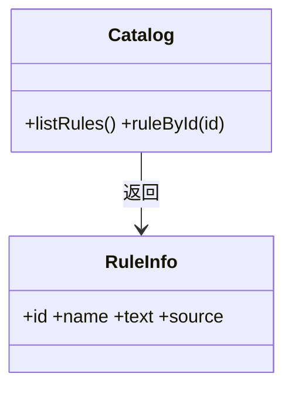
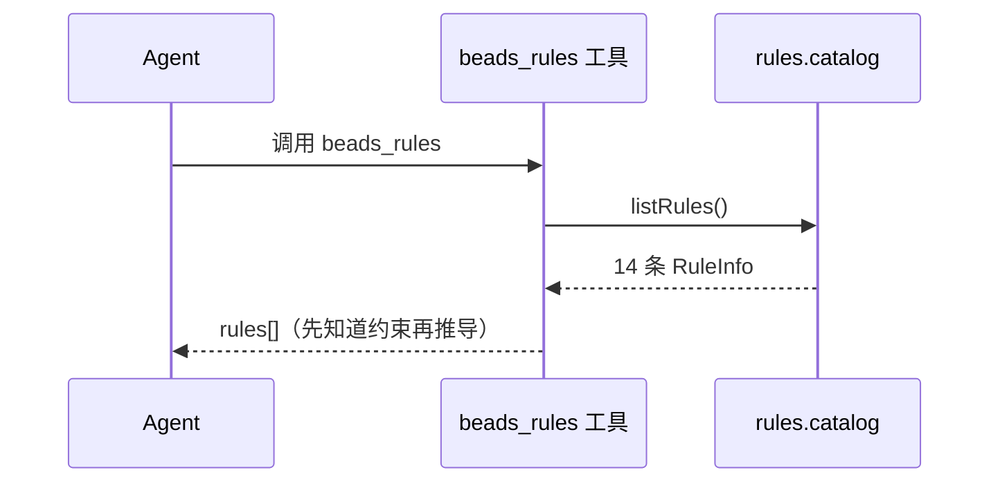
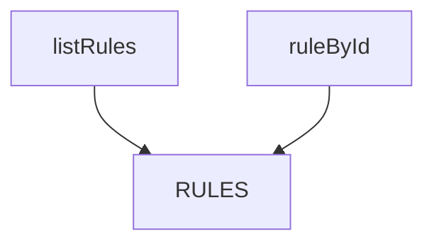

## 它做什么

给出 R1–R14 约束规则清单（编号/名称/判据/实现归属），让调用方先知道支持范围。确定性实现：不调用 LLM、不依赖网络、可重复可测试。

清单是“能力可发现性”的出口：`beads_rules` 工具直接返回它，Agent 在推导前就能知道支持哪些输入、哪些是硬约束、每条规则由哪个原子实现（`source` 字段）。

## 怎么实现

**1) 数据流转（flowchart：一份数据从输入到输出怎么走）**
```mermaid
flowchart LR
IN[无入参] --> R[RULES 常量 R1–R14]
R --> F[listRules]
F --> OUT[RuleInfo[]]
```

**2) 模块分解（classDiagram：代码/类怎么划分与归属）**


**3) 交互时序（sequenceDiagram：调用方与本原子/下游怎么协作）**


**4) 调用图（graph：本原子及其 import 的下游组合关系）**


## 何时用

- 适用：推导前查“支持哪些输入与约束”；Agent 解释边界时引用编号。
- 不适用：不执行规则；不校验输入（校验在 bazidiy.rules.guards）。

## 示例

输入 `{}` → `{ rules: [{ id:"R1", name:"干支五行", text:"十天干/十二地支映射到五行…", source:"atoms/bazidiy.calculate_chart/impl/index.ts" }, …] }`，共 14 条。
