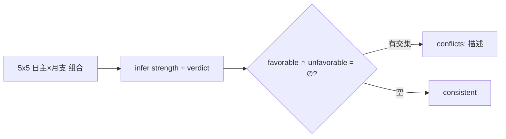
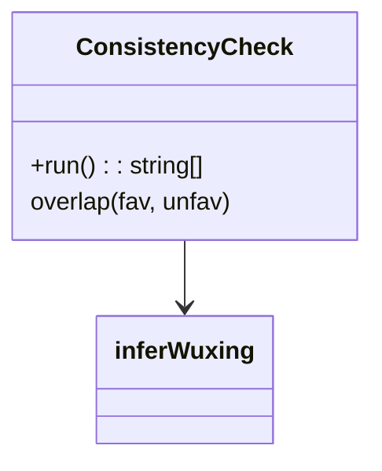
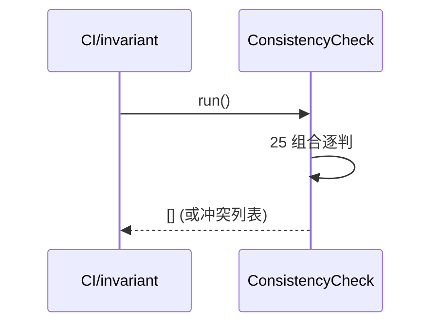
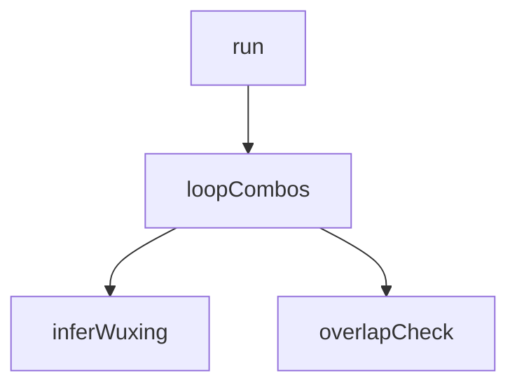

## 它做什么

自检全部旺衰×喜忌组合不存在喜忌交集冲突。确定性实现：不调用 LLM、不依赖网络、可重复可测试（CPU 上“算账”）。

一致性自检：遍历 5 日主 × 5 月支 全部组合跑旺衰+喜忌，断言 favorable 与 unfavorable 无交集；冲突以字符串列出。供规则数据变更后的回归与 dsh invariant 启动自检。

## 怎么实现

**1) 数据流转（flowchart：一份数据从输入到输出怎么走）**

**2) 模块分解（classDiagram：代码/类怎么划分与归属）**

**3) 交互时序（sequenceDiagram：调用方与本原子/下游怎么协作）**

**4) 调用图（graph：本原子及其 import 的下游组合关系）**

## 何时用

- 适用：改喜忌/旺衰规则数据后回归；服务启动自检。
- 不适用：运行时单次推理。

## 示例

输入 {} → 输出 { conflicts: [] }（当前规则数据一致）。
