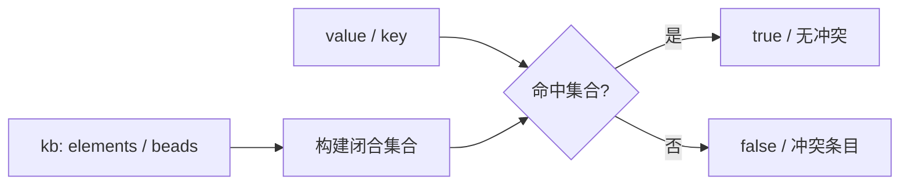
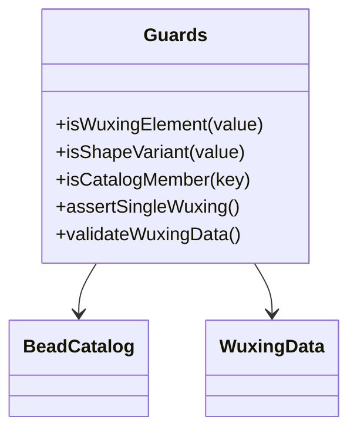
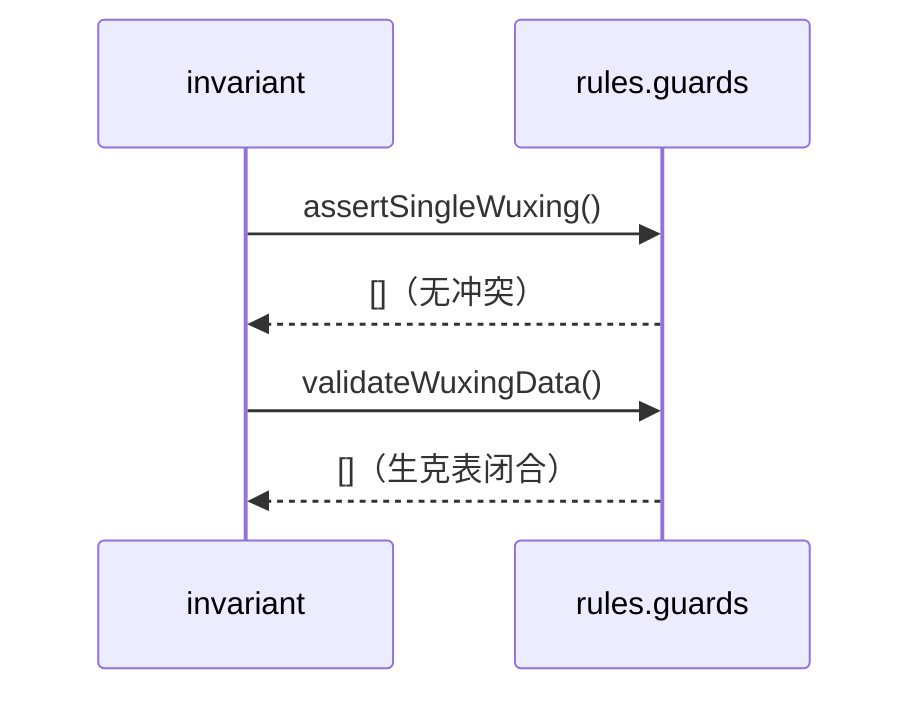
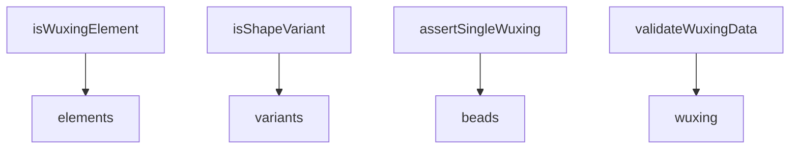

## 它做什么

封闭世界守卫：五行/珠形枚举闭合、材质五行单值、目录封闭、生克数据自洽。确定性实现：不调用 LLM、不依赖网络、可重复可测试。

对应本体图纸的 `FunctionalProperty` 与 `owl:oneOf` 枚举闭合，在 TS 侧做等价校验：域外值直接拒绝。枚举不在此重复声明——`WUXING_ELEMENTS` 取自 kb 元素顺序，`SHAPE_VARIANTS` 取自珠库实际出现的 variant，保持“词表唯一真源在 kb”。

## 怎么实现

**1) 数据流转（flowchart：一份数据从输入到输出怎么走）**

**2) 模块分解（classDiagram：代码/类怎么划分与归属）**

**3) 交互时序（sequenceDiagram：调用方与本原子/下游怎么协作）**

**4) 调用图（graph：本原子及其 import 的下游组合关系）**

## 何时用

- 适用：推导入口与 invariant 校验；任何“域外值必须被拒绝”的检查。
- 不适用：不产生推导结果；不修数据（只报告冲突）。

## 示例

`isWuxingElement('金') === true`、`isWuxingElement('X') === false`；`assertSingleWuxing()` 与 `validateWuxingData()` 均返回空数组表示数据闭合。
