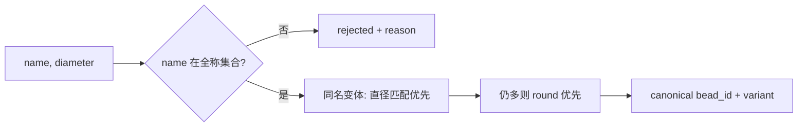
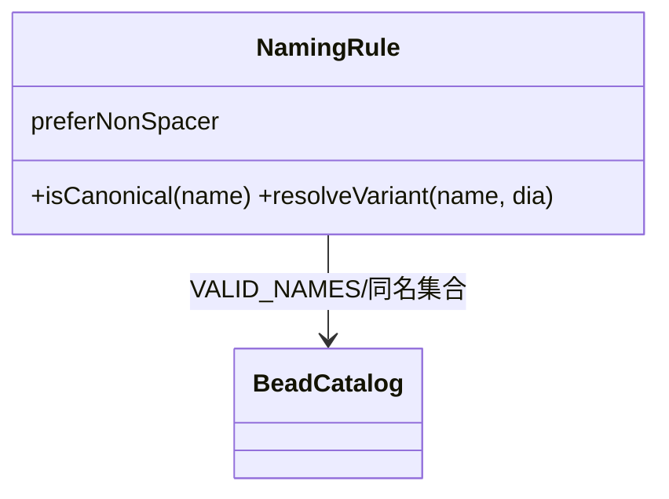
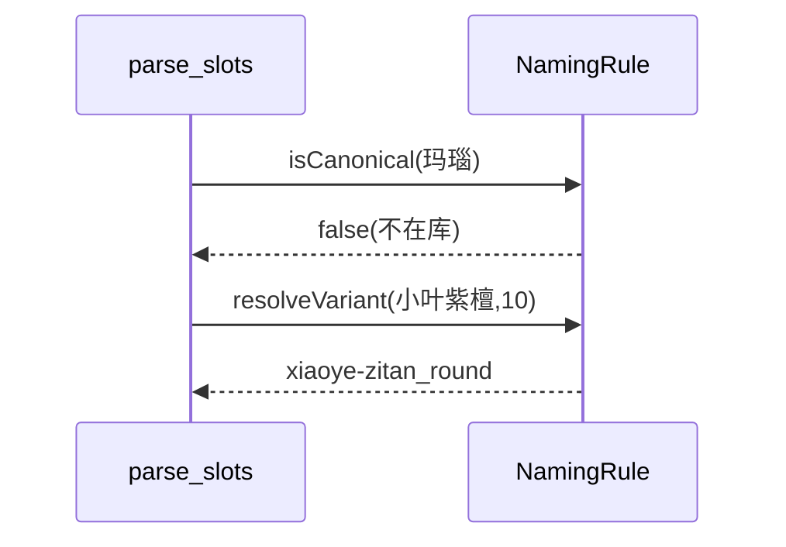
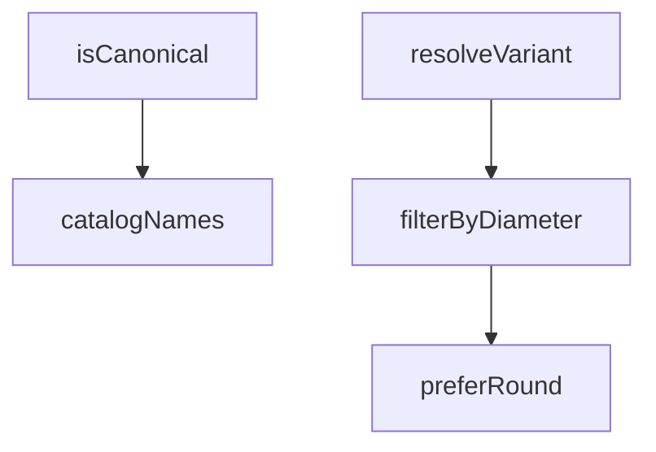

## 它做什么

定义珠子命名规则：必须全称、禁止缩写、同名变体优先非隔片。确定性实现：不调用 LLM、不依赖网络、可重复可测试（CPU 上“算账”）。

命名判据保证珠子名可用性与确定性：① 名必须在珠库全称集合 VALID_NAMES（禁缩写/编造）；② 同名多变体时优先选直径匹配、非隔片(round)的变体。供珠序解析与定稿校验调用。

## 怎么实现

**1) 数据流转（flowchart：一份数据从输入到输出怎么走）**

**2) 模块分解（classDiagram：代码/类怎么划分与归属）**

**3) 交互时序（sequenceDiagram：调用方与本原子/下游怎么协作）**

**4) 调用图（graph：本原子及其 import 的下游组合关系）**

## 何时用

- 适用：解析珠序前校验与消歧，杜绝“白玉/玛瑙”等编造名与缩写。
- 不适用：不做珠序整体解析。

## 示例

输入 { name:"小叶紫檀", diameter:10 } → { ok:true, bead_id:"xiaoye-zitan", variant:"round" }；输入 { name:"玛瑙" } → { ok:false, reason:"不在库全称集合" }。
