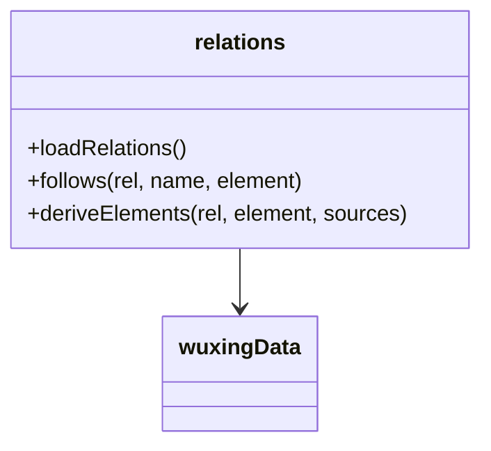
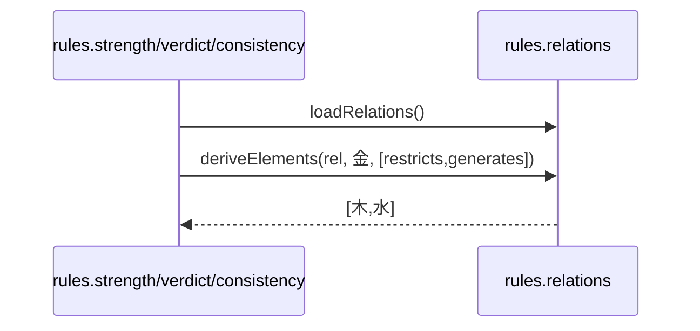
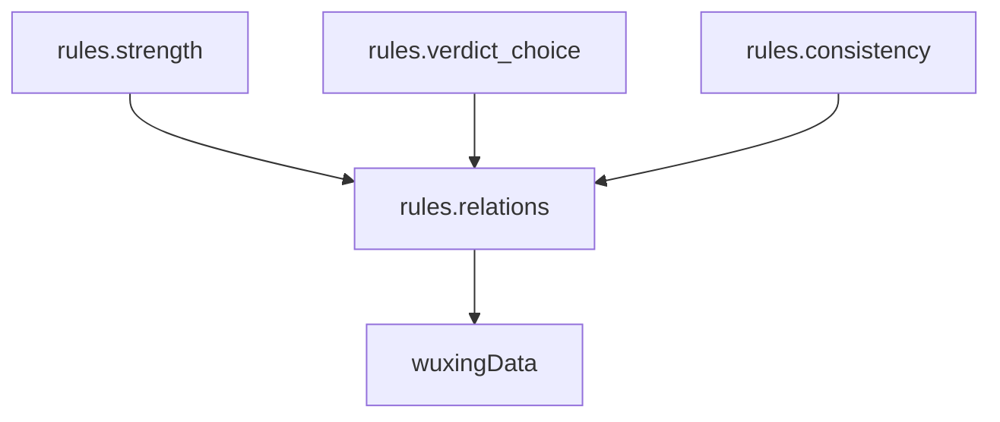

## 它做什么

五行关系访问层：加载生克关系并沿关系取后继（共享工具箱，单一定义）。确定性纯函数，不调 LLM、不联网。

被 strength（旺衰）、verdict_choice（喜忌）、consistency（自检）等规则原子**复用的共享实现**；避免各自复制一份"遍历生克"逻辑。

## 怎么实现

**1) 数据流转（flowchart）**
```mermaid
flowchart LR
D[data wuxing(生克)] --> R[loadRelations]
E[element + relation 名] --> F[follows 取后继]
E2[element + 来源关系列表] --> DE[deriveElements 去重保序]
R --> F
F --> OUT[next 或 undefined]
```

**2) 模块分解（classDiagram）**


**3) 交互时序（sequenceDiagram）**


**4) 调用图（graph）**


## 何时用

- 适用：需要沿生克图取后继、反向找"谁生我/谁克我"的任何规则/推理。
- 不适用：不做旺衰/喜忌判定本身（那是 strength/verdict_choice）。

## 示例

输入 { element:"金", relation:"generates" } → 输出 { next:"水" }；deriveElements(金, [restricts,generates]) → [木,水]。
