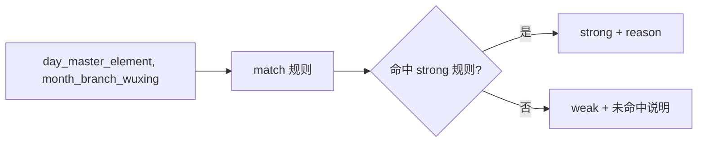
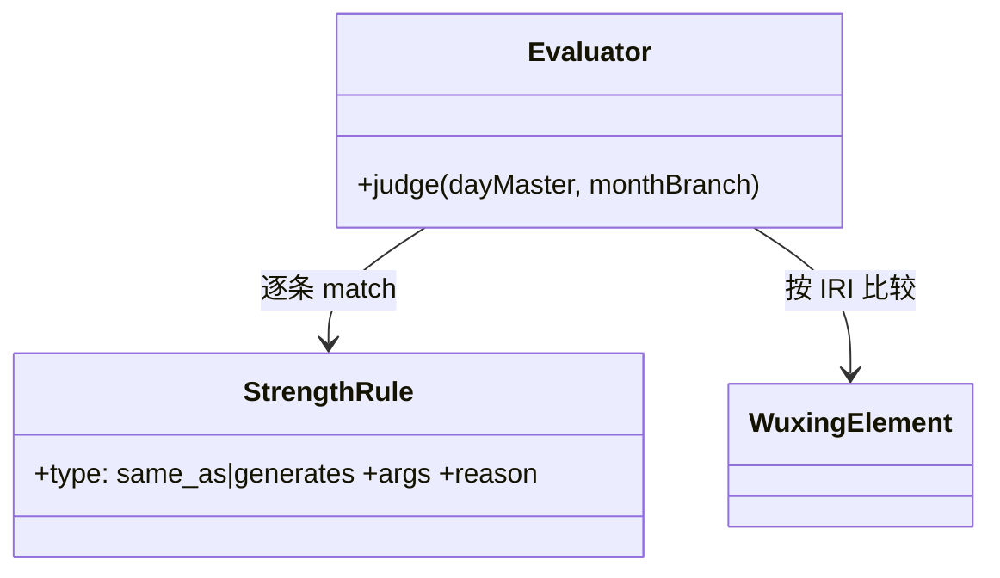
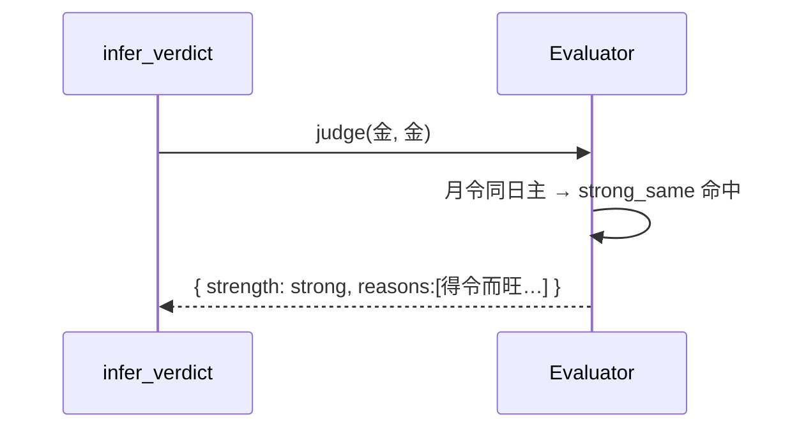
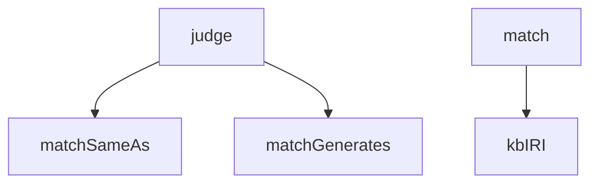

## 它做什么

依据月令与日主关系判定日主旺衰（得令/得生）。确定性实现：不调用 LLM、不依赖网络、可重复可测试（CPU 上“算账”）。

旺衰判据 = 两条同构规则（得令而旺/得生而旺），以“月支(月令) 与 日主 是否同五行 / 月令是否生日主”决定 strong 与否，理由来自命名的 rule.reason。数据来自 wuxing 本体 strength_rules，术语用 IRI 匹配。

## 怎么实现

**1) 数据流转（flowchart：一份数据从输入到输出怎么走）**

**2) 模块分解（classDiagram：代码/类怎么划分与归属）**

**3) 交互时序（sequenceDiagram：调用方与本原子/下游怎么协作）**

**4) 调用图（graph：本原子及其 import 的下游组合关系）**

## 何时用

- 适用：在喜忌选择之前判定日主强弱；判据变更只改规则数据。
- 不适用：不做喜忌组合；不排盘。

## 示例

输入 { day_master_element: 金, month_branch_wuxing: 金 } → { strength: "strong", reasons: ["月令与日主同五行，日主得令而旺"] }。
