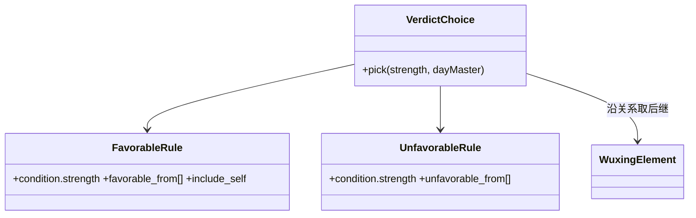
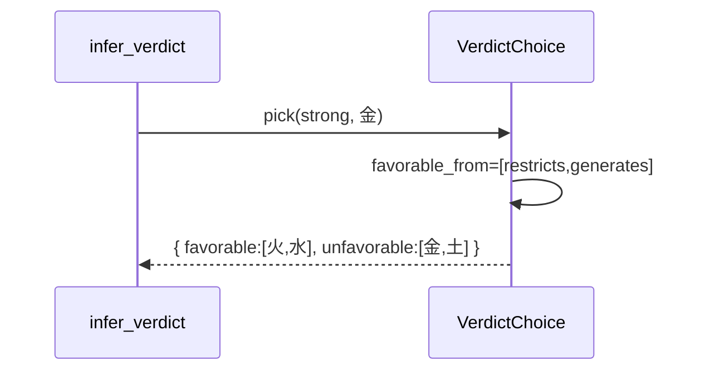
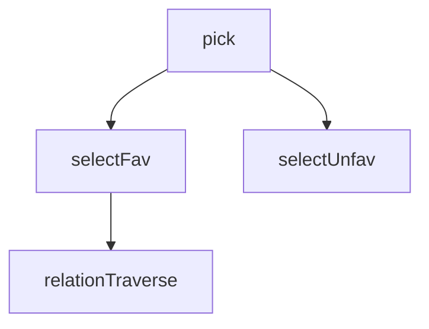

## 它做什么

依据旺衰给出喜用神与忌神选择规则。确定性实现：不调用 LLM、不依赖网络、可重复可测试（CPU 上“算账”）。

喜忌判据按 strength 选择规则族：身旺喜克泄耗（我克=财、我生=食伤）、忌比劫印；身弱喜生扶（印、比劫）、忌官杀食伤。favorable/unfavorable 通过对五行邻接（沿关系链取后继）推导，规则文件引用本体 IRI。

## 怎么实现

**1) 数据流转（flowchart：一份数据从输入到输出怎么走）**
```mermaid
flowchart LR
IN[strength, day_master_element] --> F{按 strength 选规则族}
F -- strong --> R1[favorable: restricts+generates 邻接]
F -- weak --> R2[favorable: generated_by + include_self]
R1 --> O[favorable[] + unfavorable[] + reasons]
R2 --> O
```

**2) 模块分解（classDiagram：代码/类怎么划分与归属）**


**3) 交互时序（sequenceDiagram：调用方与本原子/下游怎么协作）**


**4) 调用图（graph：本原子及其 import 的下游组合关系）**


## 何时用

- 适用：给出喜用/忌神五行集合供筛珠。
- 不适用：不做旺衰判定（那是 strength）。

## 示例

输入 { strength: "strong", day_master_element: "金" } → { favorable: ["火","水"], unfavorable: ["金","土"] }。
