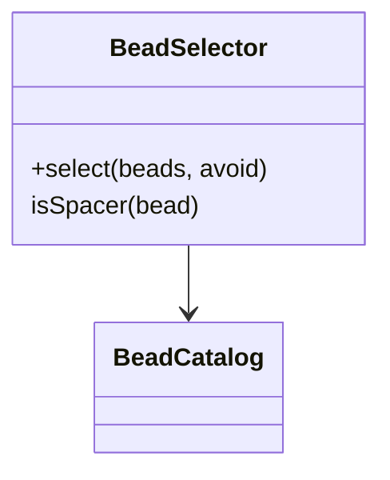
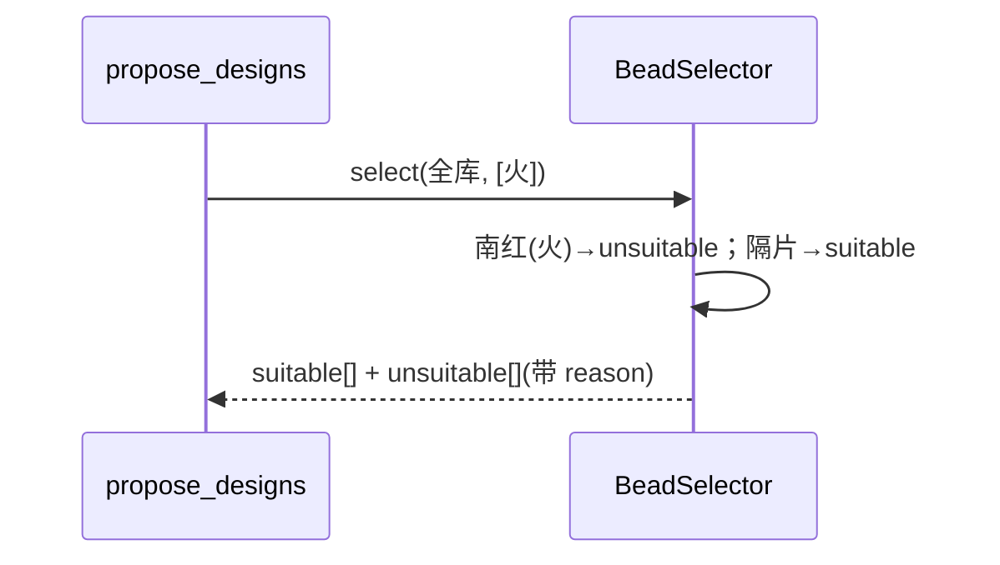
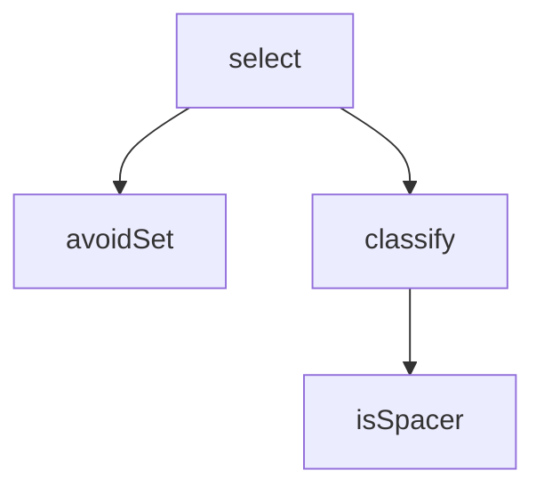

## 它做什么

按喜忌从珠子库筛出 suitable 与 unsuitable（隔片豁免）。确定性实现：不调用 LLM、不依赖网络、可重复可测试（CPU 上“算账”）。

按喜忌筛选珠子：对珠库每个实例，若其五行 ∈ 忌神集合 → 归 unsuitable 并给 reason“X 为忌神”；否则归 suitable；隔片(spacer)恒定豁免（不受五行限制）。支持 bead_ids 限定子集。

## 怎么实现

**1) 数据流转（flowchart：一份数据从输入到输出怎么走）**
```mermaid
flowchart LR
IN[beads, unfavorable[], bead_ids] --> F{五行 ∈ unfavorable?}
F -- 是且非隔片 --> OUT[unsuitable + reason]
F -- 否 --> OUT2[suitable]
note 隔片(spacer) 始终 suitable
```

**2) 模块分解（classDiagram：代码/类怎么划分与归属）**


**3) 交互时序（sequenceDiagram：调用方与本原子/下游怎么协作）**


**4) 调用图（graph：本原子及其 import 的下游组合关系）**


## 何时用

- 适用：得到喜忌后给出可/不可用珠清单；作为求解的输入。
- 不适用：不判喜忌、不解款式。

## 示例

输入 { unfavorable:["火"] } → 南红/紫金砂/珊瑚 进 unsuitable；白银/碎银子(spacer) 与木土金水系 进 suitable。
