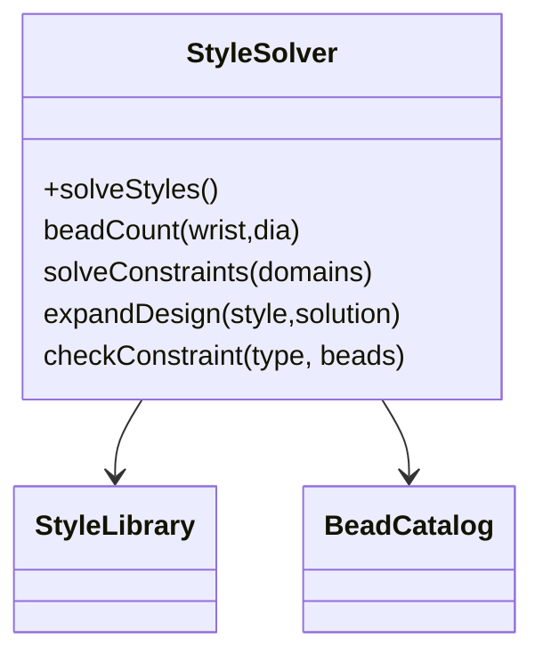
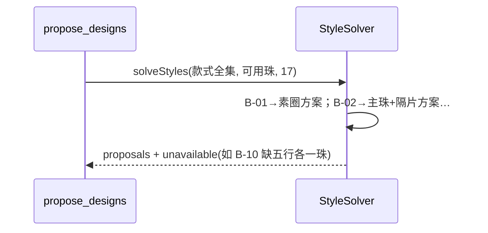
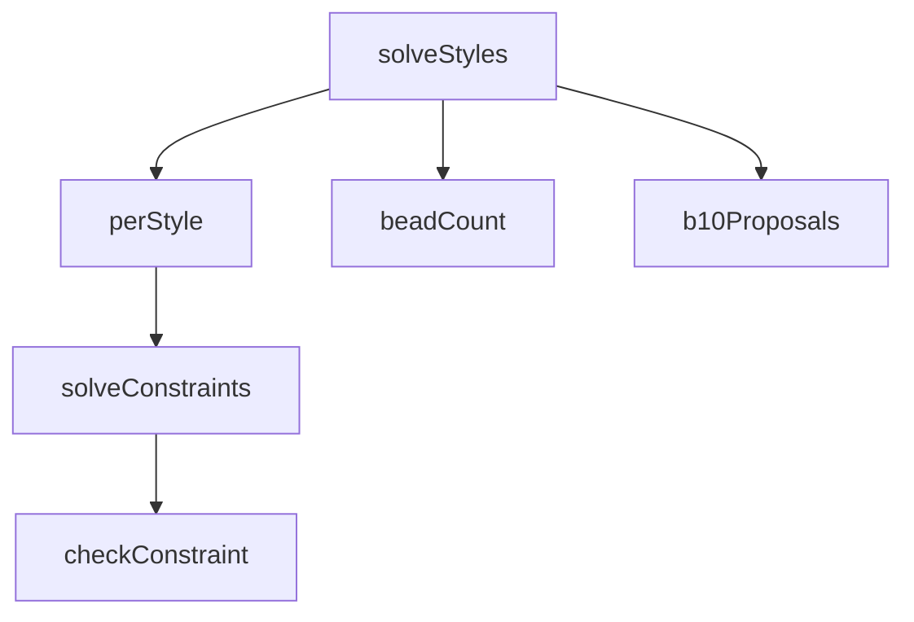

## 它做什么

按款式槽位约束枚举组合，求腕围下可行方案与不可行款式原因。确定性实现：不调用 LLM、不依赖网络、可重复可测试（CPU 上“算账”）。

款式求解：对每个款式把槽位声明转成变量域（spacer 槽取隔片、非 spacer 槽按槽位约束过滤候选珠），自写笛卡尔枚举 + 逐约束检查（diameter/spacer_map/same_bead），每个款式产出前 limit 个解再经 expandDesign/beadCount 展开为具体方案；无解则记 unavailable 原因。B-10 走“五行拼色”专用分支。

## 怎么实现

**1) 数据流转（flowchart：一份数据从输入到输出怎么走）**
```mermaid
flowchart LR
IN[styles, suitable_beads, wrist_size] --> S[按款式构造域]
S --> E[递归枚举(笛卡尔 + 剪枝)]
E --> C{逐约束 checkConstraint?}
C -- 不满足 --> X[unavailable + reason]
C -- 满足 --> EXP[expandDesign + beadCount]
EXP --> OUT[proposals[]]
```

**2) 模块分解（classDiagram：代码/类怎么划分与归属）**


**3) 交互时序（sequenceDiagram：调用方与本原子/下游怎么协作）**


**4) 调用图（graph：本原子及其 import 的下游组合关系）**


## 何时用

- 适用：给可用珠+腕围产出一组可选款式方案。
- 不适用：不判喜忌；不做最终定稿文案。

## 示例

输入 { suitable_beads:[木金土…], wrist_size:17 } → { proposals:[{style:B-01, beads:"小叶紫檀:8,…", count:22}…], unavailable:[{style:B-10, reason:"五行各缺一种可选珠"}] }。
