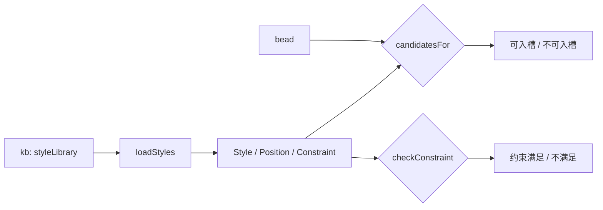
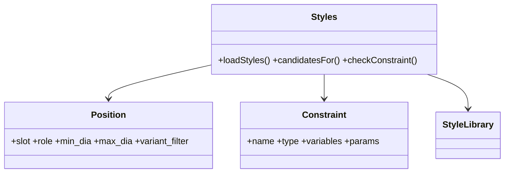
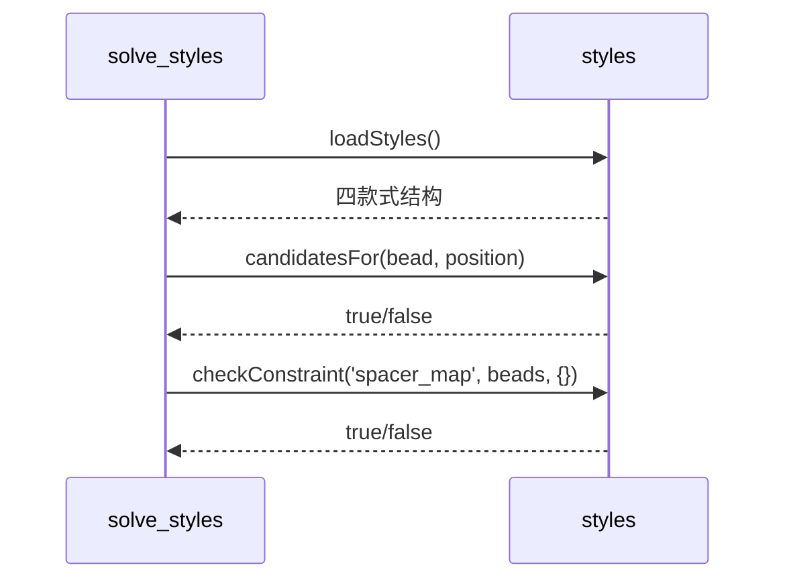
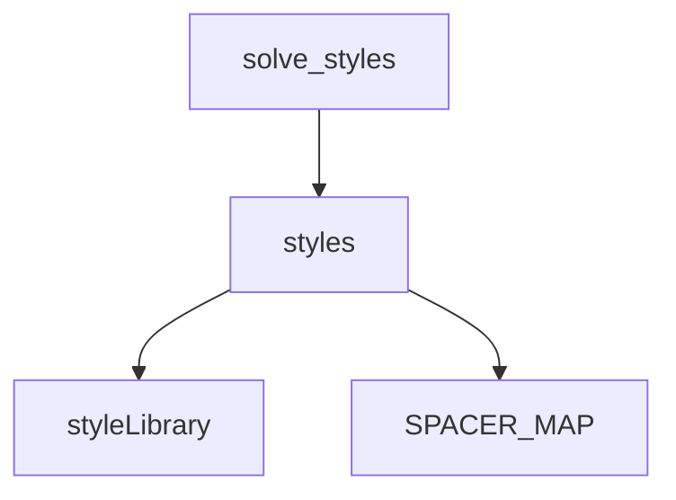

## 它做什么

从款式库构建 Style/Position/Constraint，并提供候选过滤与约束校验器。确定性实现：不调用 LLM、不依赖网络、可重复可测试。

把 kb 里的款式声明（槽位/约束/隔片直径映射）还原成可编程结构：`loadStyles()` 产出四款式；`candidatesFor()` 按槽位的 variant/直径过滤候选珠；`checkConstraint()` 执行 diameter / spacer_map / same_bead 三类约束；`SPACER_MAP` 是主珠径→隔片径的唯一映射。

## 怎么实现

**1) 数据流转（flowchart：一份数据从输入到输出怎么走）**

**2) 模块分解（classDiagram：代码/类怎么划分与归属）**

**3) 交互时序（sequenceDiagram：调用方与本原子/下游怎么协作）**

**4) 调用图（graph：本原子及其 import 的下游组合关系）**

## 何时用

- 适用：任何按款式槽位筛选候选珠或校验一组珠子的场景；求解枚举在 solve_styles。
- 不适用：不做组合枚举/珠数计算（bazidiy.solve_styles）；不定义款式数据（bazidiy.kb）。

## 示例

输入 { style_id:"B-02" } → 4 个槽位 + 2 条约束（diameter、spacer_map）；`candidatesFor(南红, {variant_filter:['round']})` → true；`checkConstraint('unknown', …)` 抛错。
