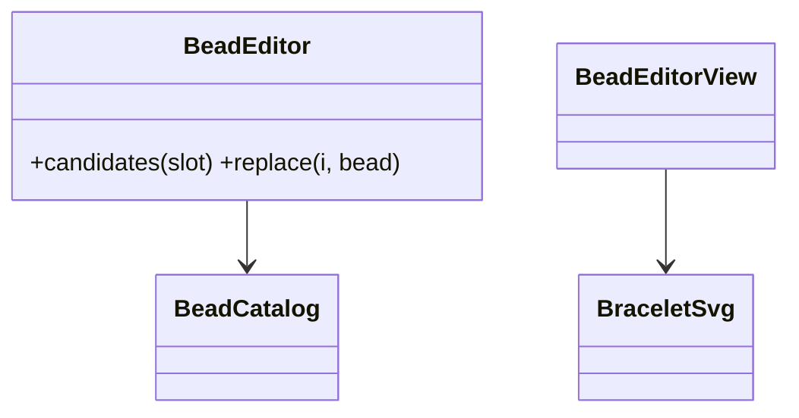
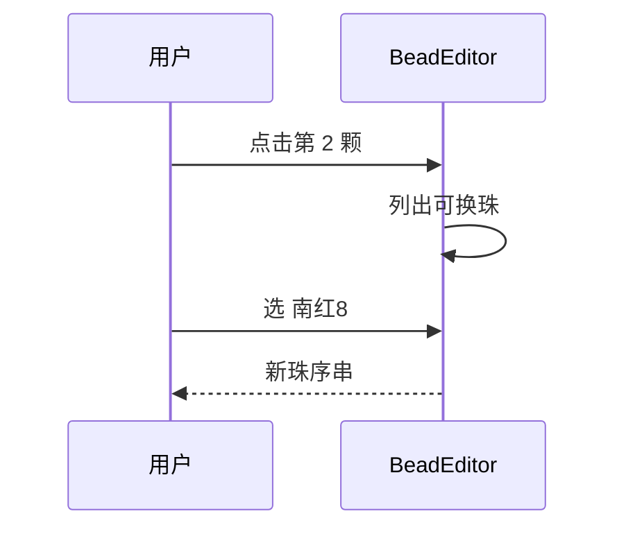
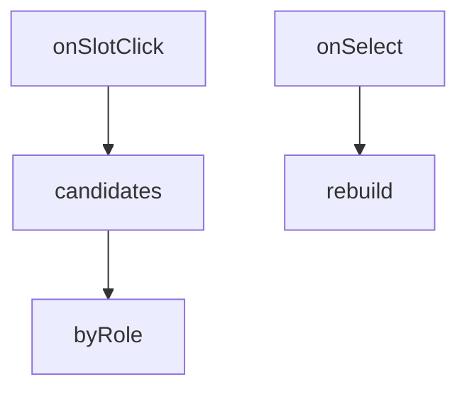

## 它做什么

可视化逐颗换珠与调直径的编辑器。确定性实现：不调用 LLM、不依赖网络、可重复可测试（CPU 上“算账”）。

可视化换珠编辑器：基于 BeadCatalog 给当前序列每颗珠提供可替换候选（同槽位约束），选中即换并回调新珠序；内部复用手串 SVG 实时预览。

## 怎么实现

**1) 数据流转（flowchart：一份数据从输入到输出怎么走）**
```mermaid
flowchart LR
IN[slots[] + catalog] --> ED[逐槽候选(按角色/直径)]
ED --> PICK[用户替换/调直径]
PICK --> NEW[新珠序串]
NEW --> OUT[beads 回填 generate_design]
```

**2) 模块分解（classDiagram：代码/类怎么划分与归属）**


**3) 交互时序（sequenceDiagram：调用方与本原子/下游怎么协作）**


**4) 调用图（graph：本原子及其 import 的下游组合关系）**


## 何时用

- 适用：用户想换某颗珠/调直径时给出可点选编辑。
- 不适用：不生成方案、不判喜忌。

## 示例

输入 { slots:[…3 槽] } → 用户把第 2 颗换成 南红:8 → 输出 { beads:"南红:8,南红:8,南红:8" }。
