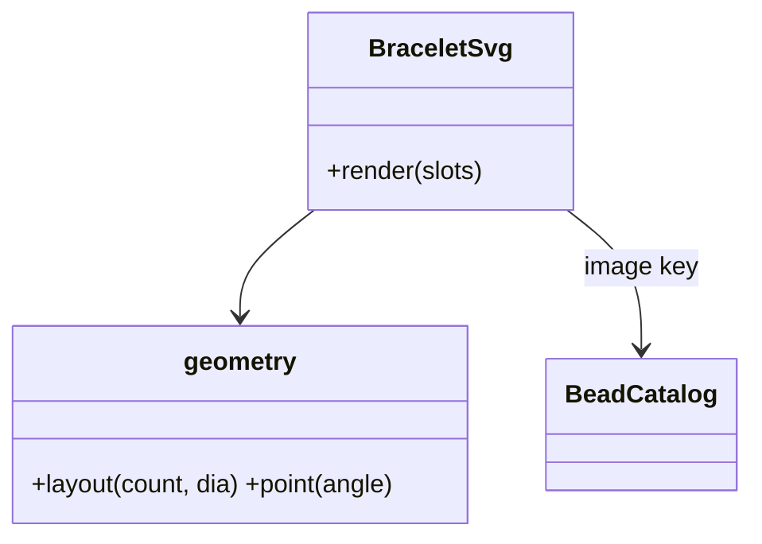
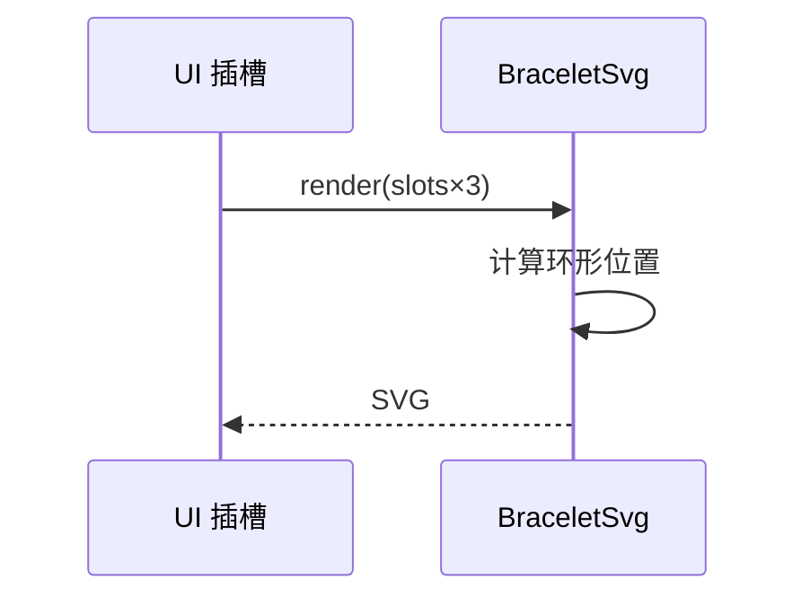
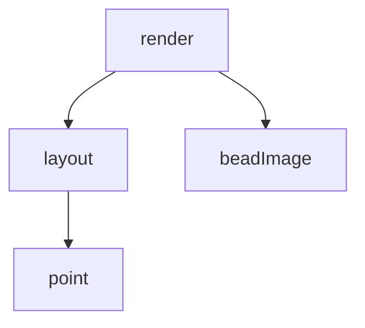

## 它做什么

把定稿槽位序列渲染成手串 SVG 卡片。确定性实现：不调用 LLM、不依赖网络、可重复可测试（CPU 上“算账”）。

把定稿槽位序列渲染成手串 SVG：geometry.ts 按腕围/珠径算环形排布与每颗珠的圆心角，BraceletSvg.tsx 依槽位 image 键取图并输出 SVG 卡片（图片按 ratio 缩放），供 dsh 前端插槽展示。

## 怎么实现

**1) 数据流转（flowchart：一份数据从输入到输出怎么走）**
```mermaid
flowchart LR
IN[slots[]] --> G[geometry: 环形坐标 + 缩放]
G --> R[每槽: <image> + 布局]
R --> OUT[SVG 卡片]
```

**2) 模块分解（classDiagram：代码/类怎么划分与归属）**


**3) 交互时序（sequenceDiagram：调用方与本原子/下游怎么协作）**


**4) 调用图（graph：本原子及其 import 的下游组合关系）**


## 何时用

- 适用：向用户展示成品手串图；工具结果 render 阶段。
- 不适用：不做换珠编辑。

## 示例

输入 { slots:[{name:南红,image:nanhong_round,ratio:1},…] } → 输出 SVG markup（环形排列的珠图）。
