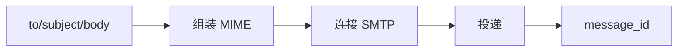
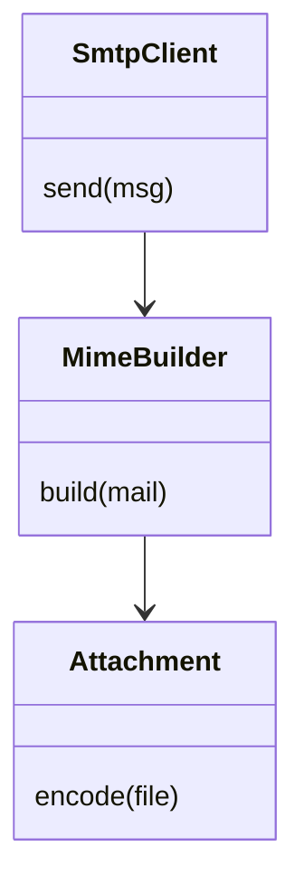
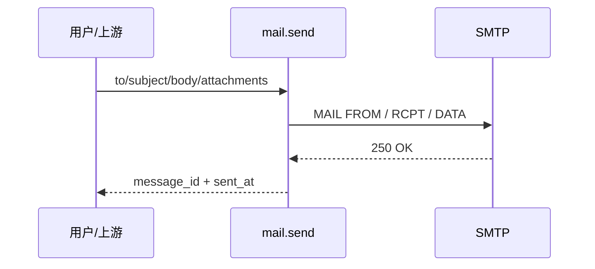
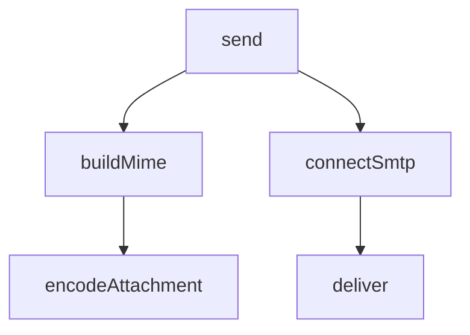

## 它做什么

把 to/cc/subject/正文与可选附件交给发件账号，完成一封邮件投递并返回 message_id。

## 怎么实现

数据流转：

模块分解：

交互时序（碰世界：email）：

调用图：

## 何时用 / 何时不用

- 适用：通知、报表送达、带附件的自动邮件。
- 不适用：需要阅读收件箱（那是另一类能力）；大批量营销邮件请走专门服务（否则易被限流）。

## 示例

输入：`{to:[you@example.com], subject:hi, body_text:hello}` → 输出：`{message_id:<id>, sent_at:<时间>}`
