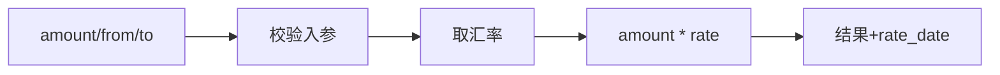
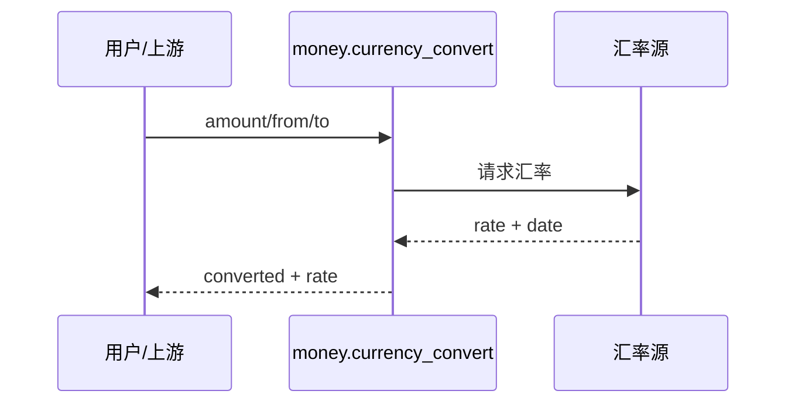
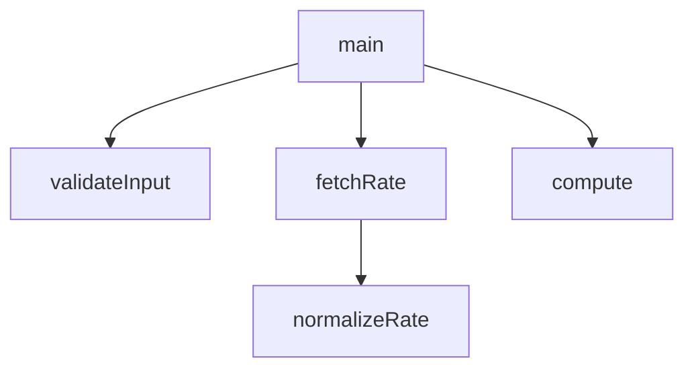

## 它做什么

按实时汇率把一笔金额从源币种换算成目标币种，返回换算结果、所用汇率与汇率日期。

## 怎么实现

数据流转：


模块分解：
```mermaid
classDiagram
  class Validator { check(amount, from, to) }
  class RateService { fetch(from,to) }
  class Converter { convert(amount,rate) }
  Validator --> RateService --> Converter
```

交互时序（需联网取汇率）：


调用图：


## 何时用 / 何时不用

- 适用：按当前汇率做一次性换算（发票、报表、预算）。
- 不适用：需要离线可用的固定汇率（可用 rate_source 指自有源）；需要历史汇率回测时需另接行情原子。

## 示例

输入：`{amount:100, from:USD, to:CNY}` → 输出：`{converted:<金额>, rate:<汇率>, rate_date:<日期>}`
