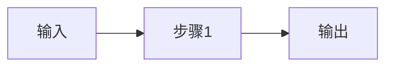
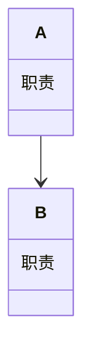
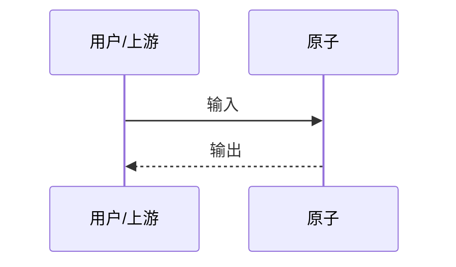
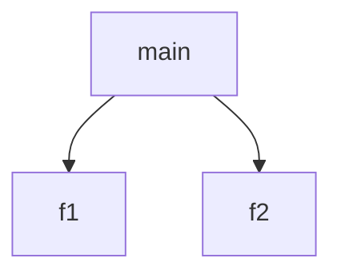

# Detail Convention · 原子详情正文规范（v0.2 · 机器闸）

> `description` **必填**，且必须包含四节标题 + 四张 Mermaid 图。全部为**机器硬检**：校验通过 = 收录，**无人工评审**。
> 机器验"完整 + 合法 + 有内容"；图与实现是否一致的"真实性"由作者署名负责，将来由 `tests` 真跑逐步兑现。

## 必交内容（机器逐项检查，缺一即不收录）

`description`（Markdown 字符串）必须同时满足：

### A. 四节标题（各出现一次，顺序不限）

1. `## 它做什么`
2. `## 怎么实现`
3. `## 何时用`（标题可续写，如 `## 何时用 / 何时不用`）
4. `## 示例`

### B. 四张 Mermaid 图（各有内容、语法合法，写在哪节都行，建议集中在"怎么实现"下）

| 要素 | 必须出现的代码块 | 说明 |
| --- | --- | --- |
| 数据流转 | ```mermaid 块内含 `flowchart` | 输入 → 处理 → 输出 |
| 接口/模块分解 | ```mermaid 块内含 `classDiagram`（或 `block-beta`） | 内部分几个模块/职责 |
| 交互时序 | ```mermaid 块内含 `sequenceDiagram` | 与外部/原子的调用时序（无外部也要画：用户→原子→结果） |
| 调用图 | 任一代码块内含 `digraph` 或 `graph TD/LR/RL/BT` | 函数/步骤级调用关系 |

### C. 反例（机器会打回）

- description 缺失 / 为空
- 四节标题缺任何一个
- 四张图缺任何一张 / 图块为空 / mermaid 头名写错（如写 ```mermaid 却写 UML 文本）
- 伪造装饰图不算"机器可验"，但**一致性由作者负责**：货架有使用数据与报错通道，假图会被用户自然淘汰

## 校验器

- 商店：`scripts/validate.mjs`（含 `scripts/validate-lib.mjs` 的 `checkDescription`）
- 插件：`dsh-atom-market` 的 `atom_validate`
- 联邦层：发现器对每个外部 manifest 跑同样检查，不过 = 不收录（`registry/index.json` 只记通过者）

## 模板

```markdown
## 它做什么

一句话展开：把 X 变成 Y。

## 怎么实现

数据流转：


模块分解：


交互时序：


调用图：


## 何时用 / 何时不用

- 适用：…
- 不适用：…

## 示例

输入：… → 输出：…
```
