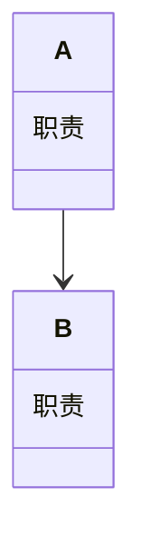
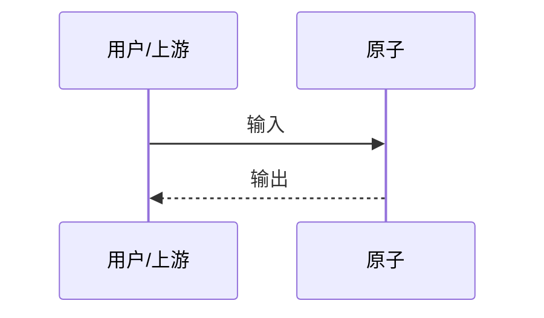
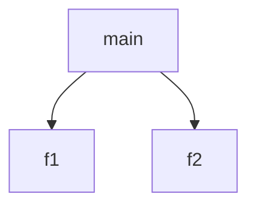

# Detail Convention · 原子文档规范（v0.3 · 整份文档 = YAML frontmatter + Markdown 正文）

> 一个原子 = **一份 `<id>.atom.md`**（SKILL.md 式）：顶部 `---` 包裹的 **YAML frontmatter**（= manifest 字段），下方是 **Markdown 正文**（= `description`，四节 + 四张 Mermaid 图）。
> 全部为机器硬检：校验通过 = 收录，无人工评审。
> 兼容：`*.atom.json`（v0.2 旧式 JSON manifest）仍可被校验器/发现器读取，但不作投稿推荐。

## 读取契约（渐进披露）

| 层 | 载体 | 消费端怎么读 |
| --- | --- | --- |
| 列表/检索 | frontmatter 的 `id + intent (+ when_to_use + category)` | 索引指针只存这些，`atom_search` 只给一行 |
| 详情 | frontmatter 之后的正文本体（四节 + 四图） | 命中后 `atom_read`/读文件整篇拉取 |

## frontmatter 写法

- 键：manifest 顶层字段（同 `spec/atom.schema.json`），其中 `description` **不放 frontmatter**——它是 frontmatter 之后的正文本体。
- 新增推荐键：`when_to_use`（何时用一句，= 正文"## 何时用"的适用首条）· `language`（正文语言，如 `zh-CN`）。缺失不报错。
- 值写法（本规范子集，机器可读）：
  - 标量：直接写；含特殊字符时用双引号。
  - 数组/对象（`tags/deps/input/output/tests`）：用 **JSON 内联**（JSON ⊆ YAML，如 `tags: ["pdf","table"]`）。
  - 布尔/数字原样。

```markdown
---
id: pdf.extract_tables
layer: capability
version: 1.2.0
intent: 从 PDF 中抽出所有表格
when_to_use: 报表、账单、论文表格需要转结构化数据时
language: zh-CN
tags: ["pdf", "table", "parse"]
category: document
side_effects: none
lang: python
author: example
verified: false
implementation_ref: "example: python package"
input: {"type":"object","required":["pdf_bytes"],"properties":{…}}
output: {"type":"array","items":{…}}
tests: [{"input":{…},"expect":{…}}]
---

## 它做什么
…
```

## 正文（= description）必交内容（机器逐项检查，缺一即不收录）

### A. 四节标题（各出现一次）

1. `## 它做什么`
2. `## 怎么实现`
3. `## 何时用`（可续写，如 `## 何时用 / 何时不用`）
4. `## 示例`

### B. 四张 Mermaid 图（各有内容；建议集中在"怎么实现"下）

| 要素 | 代码块内须含 | 说明 |
| --- | --- | --- |
| 数据流转 | `flowchart` | 输入 → 处理 → 输出 |
| 模块分解 | `classDiagram`（或 `block-beta`） | 内部分几个模块/职责 |
| 交互时序 | `sequenceDiagram` | 调用方与原子/下游协作 |
| 调用图 | `digraph` 或 `graph TD/LR/RL/BT` | 函数/步骤级调用 |

## 完整模板

```markdown
---
id: <domain.verb>
layer: capability
version: 1.0.0
intent: <一句话意图>
when_to_use: <何时用一句>
language: zh-CN
tags: ["a", "b"]
category: other
side_effects: none
lang: python
author: <you>
verified: false
input: {"type":"object","required":[],"properties":{}}
output: {"type":"object","properties":{}}
---

## 它做什么

一句话展开：把 X 变成 Y。

## 怎么实现

**1) 数据流转（flowchart）**


**2) 模块分解（classDiagram）**


**3) 交互时序（sequenceDiagram）**


**4) 调用图（graph）**


## 何时用 / 何时不用

- 适用：…
- 不适用：…

## 示例

输入：… → 输出：…
```

## 反例（机器打回）

- 不以 `---` 开头 / frontmatter 未闭合
- 缺少 `id/layer/version/intent` 等必填键；数组/对象值不是合法 JSON 内联
- 正文缺失四节标题 / 四张图任何一张 / mermaid 头名写错
- 文件名 ≠ `<id>.atom.md`

## 校验器

- 中央：`node scripts/validate.mjs`（同时扫 `*.atom.md` 与旧 `*.atom.json`）
- 单文件：`node scripts/validate-single.mjs x.atom.md`
- 联邦：`scripts/discover.mjs` 对仓库内 `atom.md / atoms/*.atom.md`（及旧 `.atom.json`）跑同一检查，不过 = 不收录
