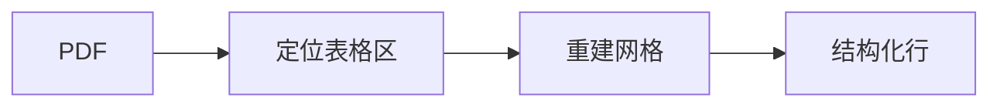

# Detail Convention · 原子详情正文规范（渐进披露 L2）

> 用途：规定 atom 的 `description`（Markdown 详情）怎么写，让每个原子的"怎么实现"长得一致、可被人与 AI 一致消费。
> 依据：Agent Skills 的 SKILL.md 约定（frontmatter=一句话，正文=详情）+ Diátaxis 文档规范的压缩四节。图用 Mermaid/DOT 文本。

## 分层关系

| 层 | 载体 | 说什么 |
| --- | --- | --- |
| L1 列表 | manifest `intent`（等同 skill frontmatter 的 description） | 一句"它实现什么" |
| L2 详情 | manifest `description`（本文规范） | "怎么实现/边界/用法" |
| L3 图纸 | `implementation_ref` 指向作者仓里的 mermaid/dot/img | 流程图/调用图/依赖图 |

## description 必须包含的四节（按序）

详情正文是 Markdown 字符串，**至少**含以下三个标题，顺序固定：

1. `## 它做什么` —— 用一两句补足 `intent`（intent 是列表短句，这里可展开到"输入会变成什么输出"）。
2. `## 怎么实现` —— 关键思路/算法/步骤，写到"另一个开发者或 Agent 能据此判断是否适用、可否拆装"的程度。不贴整段代码（代码在 `implementation_ref`），可给伪代码。
3. `## 何时用 / 何时不用` —— 适用场景、不适用场景（可含"需要先接某原子"，如"扫描件需先 OCR"）。
4. `## 示例` —— 至少一个 input → output 的简短例子（不必重复 manifest 的 `tests`，给可读示例即可）。

可选第 5 节 `## 图`：内嵌文本图（mermaid 的 flowchart/sequence/class；dot 的 digraph 画调用/依赖），为渐进披露 L3 的轻量版。

## 模板（投稿照抄）

```markdown
## 它做什么

<补足 intent：把 X 变成 Y，顺带说明输出形态。>

## 怎么实现

<关键思路与步骤，可选伪代码。>

## 何时用 / 何时不用

- 适用：…
- 不适用：…（如：扫描件需先接 OCR 原子）

## 示例

输入：… → 输出：…

## 图   <!-- 可选 -->


```

## 校验

- 校验器对 `description` 只做类型检查（必须是 string）。
- 维护者复核收录时，按本节标题清单检查；缺 1-3 中任意一节 → 打回补写。
- 机器可后续加"标题齐全性"的 lint（软警告），本轮不做。

## 与 Agent Skills 的对应

| Agent Skill | 原子 |
| --- | --- |
| frontmatter `name` | `id` |
| frontmatter `description` | `intent`（列表一句话） |
| SKILL.md 正文 | `description`（本规范四节） |
| skill 引用的资源/脚本 | `implementation_ref` + 可选图纸 |
